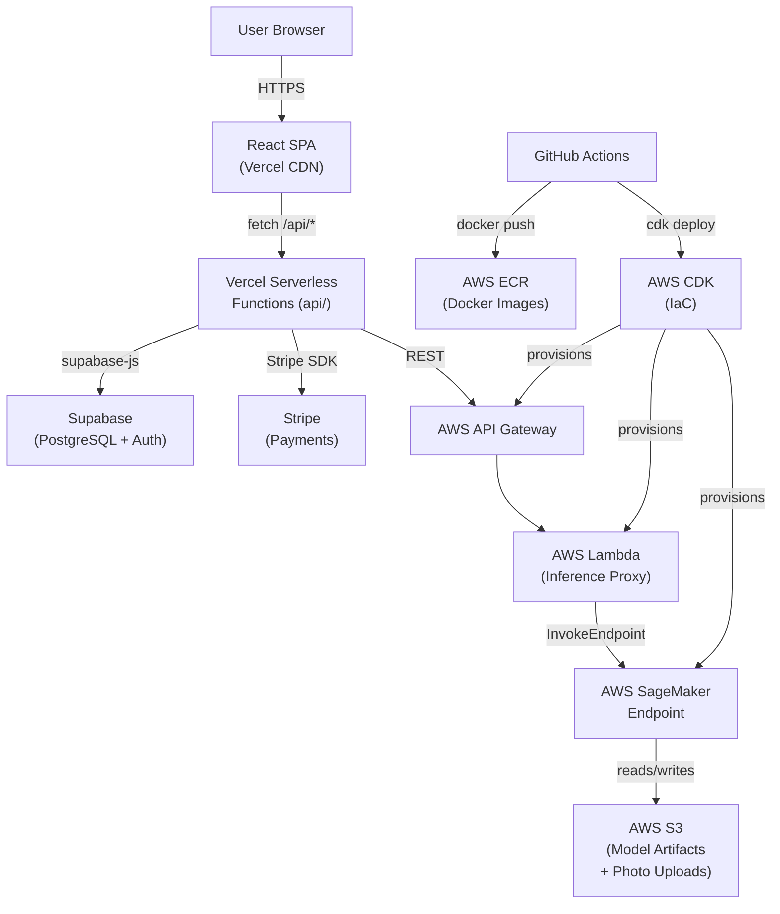

# Overnighter

Overnighter is a mobile-first web app for overlanders and dispersed campers — it maps free camping spots (BLM, USFS, NPS), lets users check in, report conditions, plan multi-day routes, and share trip logs. It now includes an **AI-powered faucet status classifier** that tells you at a glance whether a campsite water source is working, broken, or absent, directly from a photo.

---

## ✨ AI Faucet Status Classifier

### What it does

Upload a photo of a water faucet at a campsite and the app will classify it as one of three states:

| Label | Meaning |
|---|---|
| `working` | 💧 Water is flowing / faucet appears functional |
| `broken` | ⚠️ Faucet is visibly damaged or non-functional |
| `no_faucet` | ❌ No faucet detected in the image |

The result is displayed with a confidence score so you can judge how reliable the prediction is.

### How to use it

Navigate to **`/faucet-checker`** in the app. Select or drag-and-drop a photo — the result appears within seconds.

### How it works

```
Browser → POST /api/faucet-classify (multipart/form-data)
       → Vercel Serverless Function
       → AWS API Gateway → Lambda (inference proxy)
       → SageMaker Real-Time Endpoint (ResNet-18)
       → { label, confidence }
```

The model is a ResNet-18 fine-tuned for faucet classification. Inference runs on a SageMaker real-time endpoint; the Lambda + API Gateway layer handles auth, request shaping, and response normalisation so the Vercel function stays thin.

---

## 🏗 Architecture

### System Architecture



### Cloud Services

| Service | Provider | Purpose | Connected To |
|---|---|---|---|
| **Vercel** | Vercel | Hosting (CDN) + Serverless Functions | Supabase, Stripe, AWS API Gateway |
| **Supabase** | Supabase | PostgreSQL database + Row-Level Security + Auth (magic link / password) | Vercel Functions |
| **Stripe** | Stripe | Subscription billing — checkout, portal, webhooks | Vercel Functions |
| **Sentry** | Sentry | Error monitoring + performance tracing (client-side via `@sentry/react`) | React app |
| **AWS S3** | AWS | ML model artifacts, training datasets, photo uploads | SageMaker, Lambda |
| **AWS SageMaker** | AWS | Model training jobs + real-time inference endpoint (ResNet-18) | Lambda, S3 |
| **AWS Lambda** | AWS | Inference proxy — auth, request shaping, response normalisation | API Gateway, SageMaker |
| **AWS API Gateway** | AWS | REST API front-door for the inference Lambda | Vercel Functions, Lambda |
| **AWS ECR** | AWS | Docker image registry for Lambda container images | GitHub Actions, Lambda |
| **AWS CDK** | AWS | Infrastructure as Code (TypeScript) — provisions all AWS resources | GitHub Actions |

### Infrastructure as Code

- **Tool:** AWS CDK (TypeScript)
- **Location:** `infra/`
- **Entry point:** `infra/bin/app.ts` → `OvernighterAiStack`

Key resources the stack provisions:

| Resource | Why it exists |
|---|---|
| SageMaker Model + Endpoint Config + Endpoint | Serves real-time faucet classification inference |
| Lambda Function (container image from ECR) | Thin proxy between API Gateway and SageMaker; handles auth and marshalling |
| API Gateway REST API | Public HTTPS entry-point that Vercel serverless functions call |
| S3 Bucket | Stores model artifacts and training data |
| ECR Repository | Hosts the Docker image for the Lambda container |
| IAM Roles | Least-privilege roles for Lambda → SageMaker and SageMaker → S3 |

**Deploy:**

```bash
cd infra
npm ci
npx cdk diff     # preview changes against deployed stack
npx cdk deploy   # deploy to AWS
```

### CI/CD Pipeline

#### `ci.yml` — Quality gate (every PR + push to `main`)

Runs on every pull request and every push to `main`. Cancels in-progress runs for the same ref.

```
checkout → setup Node 20 → npm ci → lint → typecheck:api → test → build
```

#### `sync-gov.yml` — Daily government data sync (cron)

Runs at **02:00 UTC** daily (and on `workflow_dispatch`). POSTs to the `SYNC_URL` endpoint with the `ADMIN_SECRET` bearer token to pull fresh BLM / USFS / NPS pin data into the database. Timeout: 180 s.

---

## 🐳 Local Development

### Prerequisites

- **Node.js** 24.x
- **Docker** + **Docker Compose** (optional, for full-stack local dev with mock inference)

### Quick Start

```bash
# 1. Install dependencies
npm install

# 2. Copy the environment template and fill in your values
cp .env.example .env

# 3a. Start the Vite dev server (app only, no mock inference)
npm run dev

# 3b. OR run the full stack with Docker (includes mock SageMaker inference)
docker-compose up
```

The Docker Compose setup starts:
- **`app`** — React SPA served by nginx on `http://localhost:3000`
- **`mock-inference`** — Tiny Python HTTP server on `http://localhost:8080` that returns `{"label": "working", "confidence": 0.94}` for any POST, so you can exercise the faucet-checker UI without real AWS credentials.

### Available Scripts

| Script | Description |
|---|---|
| `npm run dev` | Vite dev server with HMR |
| `npm run build` | TypeScript compile + Vite production build |
| `npm run lint` | ESLint across all source files |
| `npm run typecheck:api` | Type-check serverless functions (`tsconfig.api.json`) |
| `npm test` | Unit tests via Vitest |
| `npm run test:e2e` | End-to-end tests via Playwright |
| `npm run preview` | Preview the production build locally |

### Environment Variables

See **`.env.example`** for the full list with inline descriptions. The file groups variables by concern:

- `VITE_SUPABASE_*` — Supabase public keys (baked into the client bundle)
- `SUPABASE_SERVICE_ROLE_KEY` — Server-only Supabase admin key
- `STRIPE_*` / `VITE_STRIPE_PUBLISHABLE_KEY` — Stripe billing
- `VITE_SENTRY_DSN` — Sentry error tracking
- `VITE_VAPID_PUBLIC_KEY` / `VAPID_PRIVATE_KEY` — Web Push notifications
- `ADMIN_SECRET` — Bearer token for protected admin endpoints
- `SYNC_URL` — Full URL used by the GitHub Actions cron to trigger gov-data sync

---

## 🤖 ML Model

### Model Details

| Property | Value |
|---|---|
| Architecture | ResNet-18 (pretrained on ImageNet, fine-tuned for faucet classification) |
| Output classes | `working`, `broken`, `no_faucet` |
| Training platform | AWS SageMaker Training Jobs |
| Inference platform | AWS SageMaker Real-Time Endpoint |
| Inference format | JPEG/PNG image → `{ label, confidence }` |

### Training

```bash
cd ml
python train.py   # local smoke test: 1 epoch on dummy data to verify the pipeline
```

For full training on SageMaker (data prep, hyperparameters, endpoint deployment), see `ml/README.md`.

---

## 🔐 Environment Variables & Secrets

See **`.env.example`** — every variable is documented inline. Never commit `.env` or `.env.local`.

Secret groups at a glance:

| Group | Variables | Used by |
|---|---|---|
| Supabase | `VITE_SUPABASE_URL`, `VITE_SUPABASE_ANON_KEY`, `SUPABASE_SERVICE_ROLE_KEY` | App + API functions |
| Stripe | `STRIPE_SECRET_KEY`, `STRIPE_WEBHOOK_SECRET`, `STRIPE_PRICE_ID_ANNUAL`, `VITE_STRIPE_PUBLISHABLE_KEY` | API functions + app |
| Sentry | `VITE_SENTRY_DSN` | Client bundle |
| Web Push | `VITE_VAPID_PUBLIC_KEY`, `VAPID_PRIVATE_KEY`, `VAPID_SUBJECT` | API functions + service worker |
| Admin / Pipeline | `ADMIN_SECRET`, `SYNC_URL` | GitHub Actions cron, admin API |

---

## 🚀 Deployment

### Frontend + API Functions (Vercel)

Auto-deploys on every push to `main` via the Vercel GitHub integration. Preview deployments are created for every pull request. No manual steps required.

### AI Infrastructure (AWS CDK)

```bash
cd infra
npm ci
npx cdk diff     # preview what will change in the deployed stack
npx cdk deploy   # apply changes to AWS
```

AWS credentials must be configured in your shell (e.g. via `aws configure` or an assumed role). The stack reads `CDK_DEFAULT_ACCOUNT` and `CDK_DEFAULT_REGION` from the environment so no values are hard-coded.

### Required GitHub Secrets

The following secrets must be set in **Settings → Secrets and variables → Actions** for CI and the daily sync workflow to function:

| Secret | Description |
|---|---|
| `ADMIN_SECRET` | Bearer token authorising the `/api/sync-gov` endpoint |
| `SYNC_URL` | Full HTTPS URL of the sync endpoint called by the daily cron job |
| `AWS_ACCOUNT_ID` | AWS account ID used by CDK bootstrap and deploy |
| `AWS_ROLE_ARN` | IAM role ARN that GitHub Actions assumes for CDK deployments |

---

## 🗄 Database Schema

Supabase migrations live in `supabase/migrations/`. Key tables:

| Migration | What it creates |
|---|---|
| `001` | `pins` — campsite/POI locations |
| `002` | `check_ins` — user check-in records |
| `003` | `issue_reports` — user-submitted condition reports |
| `004` | `overpass_cache` — cached Overpass API responses |
| `015` | User sync tables for profile data |
| `016` | `spot_submissions` — community-submitted new spots |
| `017–020` | Trip plans, sharing, reactions, comments |
| `022` | Phase 2 foundation tables (subscriptions, saved spots) |
| `024` | Pin photos storage bucket configuration |
| `027` | `search_pins_by_radius` PostGIS function |
| `028` | Normalised trip model |
| `029` | Auto-create profile on signup trigger |
