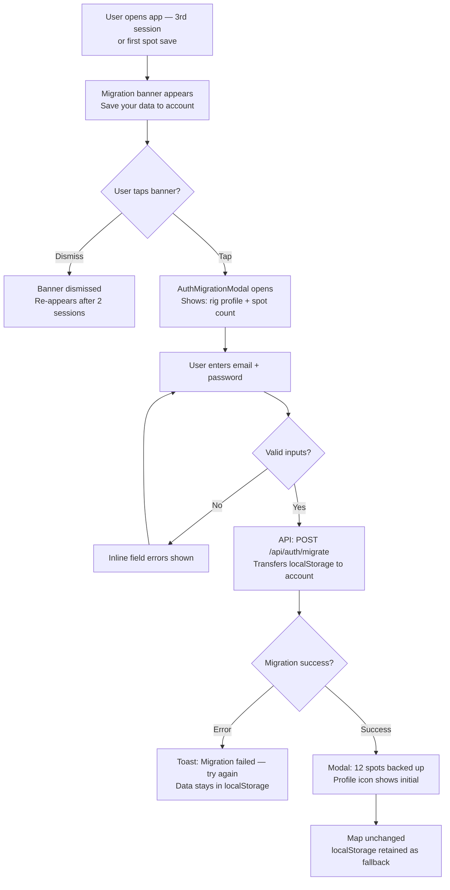
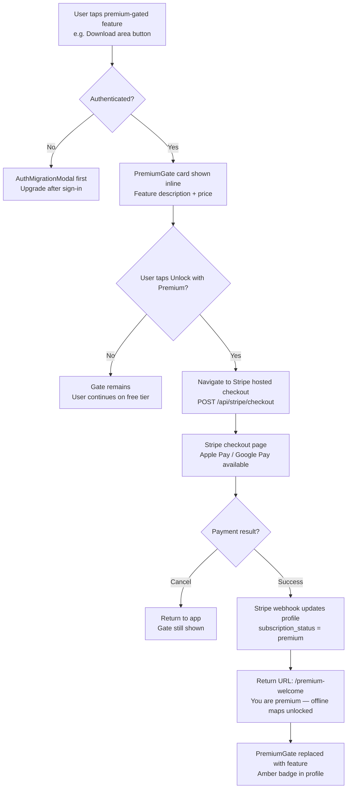
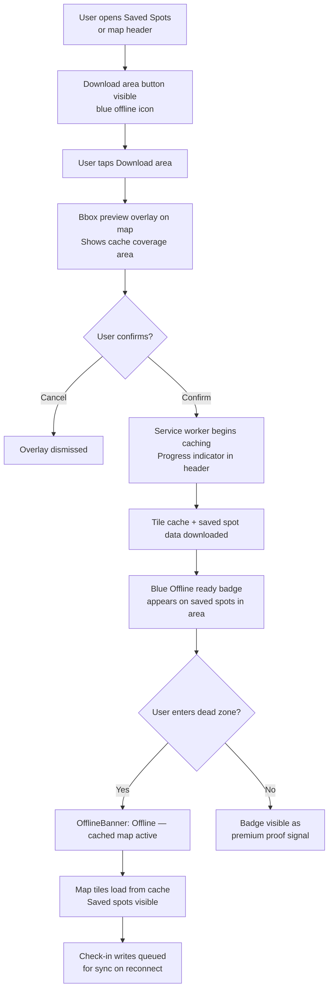
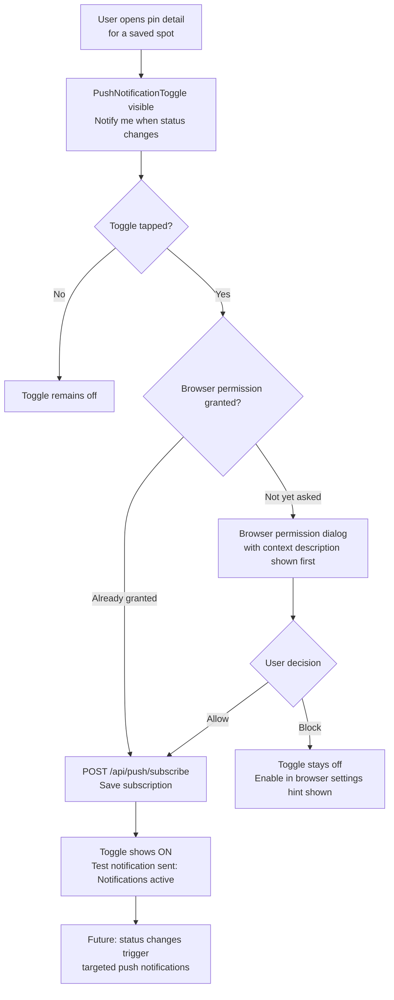
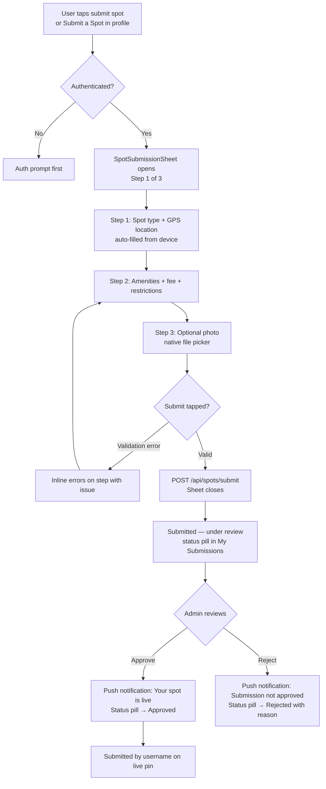
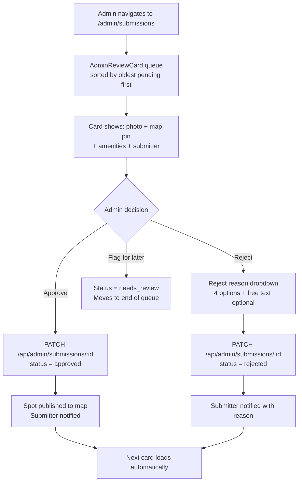

# UX Design Specification — Overnighter Phase 2
**Author:** Roman Kyryliuk
**Date:** 2026-03-24
<!-- UX design content will be appended sequentially through collaborative workflow steps -->

## Executive Summary

### Project Vision

Overnighter Phase 2 extends the validated MVP utility into a sustainable,
community-powered platform. Phase 1 proved the core loop — rig-aware map,
recency badges, departure check-ins — works for real travel days. Phase 2
adds the infrastructure layer that turns one-time users into committed
subscribers: user accounts with cloud sync, a premium subscription tier,
offline-first PWA capabilities, push notifications for saved spots, photo
uploads, crowd-sourced spot submissions, and a real admin moderation interface.

The UX challenge is layering these capabilities onto the Phase 1 foundation
without disrupting the "8 minutes and done" core loop that Marcus validated.
Every new surface must either serve the existing loop faster, extend it with
new capability, or remain completely invisible to users who don't need it.

### Target Users

**Marcus — Primary (Full-Timer, Class A) — Phase 2 evolution:**
Now a returning user with 3+ months of app history. Rig profile is set.
The Phase 2 UX must migrate his localStorage seamlessly to a cloud account,
offer offline map caching as a premium feature he'll actually pay for (dead
zones on I-10 are real), and get push alerts when his saved spots change status.

**Sarah — Secondary (Boondocker) — Phase 2 evolution:**
Deep BLM territory = offline is critical. She's the primary offline PWA user.
Premium pitch: "Your saved spots and nearby pins are cached — works where
there's no signal." She'll also be a spot submitter for undocumented BLM areas.

**Jamie — Secondary (New Full-Timer) — Phase 2 evolution:**
More confident now but still building trust. Account creation + cloud sync
gives Jamie peace of mind ("my rig profile won't disappear"). Most likely to
submit photos after positive experiences.

**New: Returning MVP user (anonymous → auth migration):**
Has been using the app for weeks or months with localStorage. Sees "Save to
your account" prompt. Must experience migration as data backup, not form-filling.

**New: Community spot contributor:**
Regular check-in submitter who graduates to submitting new spots. Needs
feedback loops: submission pending → under review → approved → live on map.

### Key Design Challenges

1. **Anonymous → authenticated transition** — localStorage rig profile + saved
   spots must migrate to cloud account invisibly. No re-entry. No data loss.
   Frame it as "backup" not "registration."

2. **Premium value communication** — Paywall gates for offline caching, push
   notifications, and photo uploads must show value before blocking. Trust-
   skeptical RVers need to see the feature working before paying.

3. **Offline state mental model** — Map with cached tiles vs. live data vs.
   fully offline is a three-state UX. Users need to know what they can and
   can't do without cellular signal, without reading docs.

4. **Push notification permission sequencing** — Browser permission asks at
   the wrong moment get denied forever. Must earn the ask with demonstrated
   value before triggering the permission dialog.

5. **Photo upload on cellular** — Progress feedback, file size guidance, and
   graceful failure recovery for 3G/rural LTE conditions common on travel days.

6. **Spot submission trust and feedback loop** — User-submitted spots may wait
   days for moderation. Submission status visibility keeps contributors engaged
   rather than abandoned.

7. **Admin triage efficiency** — Solo founder moderation queue must enable
   approve/reject decisions in under 10 seconds per submission without reading
   full text.

### Design Opportunities

1. **Auth as trust upgrade** — "Your data is now safe in the cloud" framing
   turns account creation into a benefit delivery moment, not a friction gate.

2. **Offline badge as premium identity signal** — Cached spot indicators are
   visible everyday proof of premium value — even when connected.

3. **Community contributor recognition** — "Submitted by [username]" on
   approved pins creates a visible social proof loop that drives further
   submissions.

4. **Contextual push notification framing** — Showing a sample notification
   ("Flying J Ocala just got a check-in: still open") before asking for
   permission makes the permission ask obvious and trustworthy.

---

## Core User Experience

### Defining Experience

The core loop from Phase 1 is unchanged and sacrosanct:
**Search near destination → rig-filtered map → tap best spot → navigate.**

Phase 2 adds three secondary loops that must not disrupt the primary:

**Account migration loop (one-time):** Anonymous user receives a "save to
your account" prompt at a high-value moment. Rig profile, saved spots, and
check-in history migrate to cloud. Experience: "your data is now backed up."

**Offline preparation loop:** Authenticated premium user caches their saved
spots and surrounding area before a travel day. In a cellular dead zone, the
map tiles and saved pins load instantly from cache. Experience: "this is why
I paid."

**Community contribution loop:** Regular check-in submitter graduates to
creating new spots. They see submission status, receive approval notification,
and see their name on the live pin. Experience: "I put that on the map."

### Platform Strategy

Overnighter Phase 2 is an installable PWA — mobile-first browser app with
service worker capabilities:

- **Installation:** Add-to-homescreen prompt triggered after meaningful
  engagement (not on first visit). Homescreen icon = psychological commitment.
- **Service worker:** injectManifest strategy handles both offline tile
  caching and push notification delivery from a single worker.
- **Offline scope:** Cached map tiles (Leaflet tiles for saved-area bbox),
  saved spot data, and read-only pin detail views work offline. Check-in
  writes queue for sync when connectivity returns.
- **Admin UI:** Can be tablet/desktop-friendly — moderators are unlikely to
  be reviewing submissions from a moving vehicle.
- **No native app:** Phase 3 decision. PWA covers the offline and push use
  cases that motivated native app consideration.

### Effortless Interactions

These interactions must require zero cognitive load:

| Interaction | Target |
|---|---|
| Anonymous → account migration | One-step: email + password, all data carries over |
| Stripe checkout flow | Under 60 seconds from "upgrade" tap to confirmed subscription |
| Offline cache activation | Single "Download area" button in saved spots or map header |
| Push notification opt-in | Contextual ask after demonstrating a specific notification value |
| Photo attach on check-in | Native file picker, automatic compression, progress indicator |
| Spot submission form | 5 fields max visible at once; GPS auto-fills coordinates |

### Critical Success Moments

1. **The migration moment:** User sees "Your rig profile and 12 saved spots
   have been backed up to your account." Instant relief; zero re-entry required.

2. **The offline moment:** In a cellular dead zone, the app loads cached tiles
   and saved spots instantly. The cached indicator (offline-ready badge)
   was already visible before the dead zone — the user chose this capability.

3. **The push notification moment:** A specific, timely notification —
   "Flying J Ocala: new check-in — still open" — arrives the night before a
   user's typical travel day. Trust earned through relevance.

4. **The submission approval moment:** User receives "Your spot submission was
   approved and is now live on the map." Their username appears on the pin.
   The data flywheel closes another cycle.

### Experience Principles

1. **Layer on, don't replace** — Phase 2 features enhance silently or exist
   in dedicated flows. No Phase 1 user should feel their workflow disrupted.

2. **Earn before ask** — Auth prompts, push permission requests, and premium
   gates are always preceded by demonstrated value. No cold-ask blocking.

3. **Offline as a superpower** — Offline mode is a premium capability users
   choose to activate, not a degraded fallback they stumble into. Design it
   with that framing at every touchpoint.

4. **Community recognition drives contribution** — Every check-in, photo, and
   spot submission must produce visible acknowledgment. The data flywheel is
   the business model; design for it explicitly.

5. **Admin for speed** — The moderation queue must enable approve/reject in
   under 10 seconds per submission. Full context on one screen, one action,
   no confirmation dialogs for routine decisions.

---

## Desired Emotional Response

### Primary Emotional Goals

Phase 2 extends Phase 1's core emotional promise (confidence) with two
new emotional dimensions:

**Confidence (inherited from Phase 1):** Marcus opens the app and drives
with it. Every rig-aware pin, every green recency badge, every one-tap
direction reinforces this. Phase 2 must not erode it.

**Relief (Phase 2 addition):** "My data is safe. My rig profile survived.
It works where there's no signal." These are anxiety points specific to the
RVer audience. Phase 2 resolves them through auth migration, offline caching,
and cloud sync — but only if the UX frames them as relief delivery, not
friction introduction.

**Belonging (Phase 2 addition):** "I submitted that spot. My name is on
it. The community uses my data." The step from consumer to contributor is an
identity shift. Design must support this transition with visible recognition
at every stage.

### Emotional Journey Mapping

| Stage | Target feeling | Emotion to avoid |
|---|---|---|
| Auth prompt encounter | Curiosity + low pressure | Trapped or coerced |
| Account migration complete | Relief + trust | Anxiety about data loss |
| Stripe checkout | Confident + decisive | Suspicious or second-guessing |
| First offline use in dead zone | Delight + vindication | Confusion ("is this broken?") |
| Push notification received | Appreciated + timely | Interrupted or spammed |
| Photo upload complete | Pride + contribution | Frustration from failure |
| Spot submission submitted | Hopeful + patient | Abandoned or ignored |
| Spot submission approved | Pride + recognition | Indifference |
| Admin triage | Efficient + in control | Overwhelmed or fatigued |

### Micro-Emotions

**Trust vs. skepticism** — The dominant tension for this audience with any
premium feature. Every paywall, permission ask, and payment form must look
and feel legitimate. Stripe-hosted checkout (not custom form) is a design
decision driven entirely by this emotional need.

**Confidence vs. confusion** — Offline mode has three states (live, cached,
fully offline). Users must always know which state they're in. Technical
ambiguity becomes emotional anxiety for a traveler in a dead zone.

**Accomplishment vs. frustration** — Photo uploads and spot submissions are
effort-intensive contributions. A failed upload at the end of a form is a
trust-destroying moment. Progress states, auto-retry, and graceful failures
are emotional design requirements, not just technical ones.

**Belonging vs. isolation** — Community contributor identity must be reinforced
at each stage (pending, approved, live). Silence between submission and approval
feels like abandonment. Status visibility is an emotional feature.

### Design Implications

| Target emotion | UX design approach |
|---|---|
| Relief at auth migration | Copy leads with "your data is backed up" — show rig profile auto-filled post-migration |
| Trust in Stripe checkout | Stripe-hosted page; no custom payment form; no surprises |
| Delight at offline use | Visible "offline-ready" indicator before the dead zone; badge activates when cache is ready |
| Appreciated via push notification | First notification must be specific and accurate; wrong data = permission revoked forever |
| Pride at submission approval | Two-part recognition: approval notification + visible username on live pin |
| Efficiency in admin triage | Single-screen submission card with approve/reject in same view; no second confirmation for routine decisions |

### Emotional Design Principles

1. **Relief before friction** — Every new Phase 2 capability (auth, offline,
   subscription) must be framed around what anxiety it resolves, not what
   capability it adds. "Your spots are safe" > "Create an account."

2. **Specificity builds trust** — Generic prompts ("Get notifications") erode
   trust. Specific, contextual prompts ("Get alerted when Flying J Ocala gets
   a new check-in") earn it. Specificity is an emotional design tool.

3. **Failure is a contributor moment** — Upload failures, sync errors, and
   offline limitations must present recovery paths immediately. Frustration
   is a design choice, not an inevitability.

4. **Visible recognition fuels the flywheel** — Community contribution is
   emotionally motivated. Approval notifications, username attribution, and
   submission status are not nice-to-haves — they are the mechanism that
   keeps contributors contributing.

---

## UX Pattern Analysis & Inspiration

### Inspiring Products Analysis

**iOverlander (shut down 2025) — community spot model:**
The closest prior art. Successes to carry forward: photo-first check-in CTA,
submission attribution ("Added by [username]"), and pending/approved status
chips on contributor profiles. Failure to avoid: silent submission acceptance
and data loss on late sign-up that killed contributor motivation.

**AllTrails+ — outdoor premium subscription analog:**
Strongest model for offline download UX and premium gate timing. "Download
this area" button in the map header with bbox preview is the exact interaction
model for Overnighter's offline cache feature. Green "Offline ready" badge on
saved trails is the visual pattern for our cached spots indicator.

**Duolingo — subscription for trust-skeptical audience:**
Freemium boundary is always "try → hit natural limit → upgrade." Upsell
appears after a streak milestone — an earned moment, not a cold gate. The
emotional lock-in from contribution history (streak) is the model for
framing account migration: "Your 14 check-ins and 8 saved spots are in your
account now."

**Notion — browser permission asks done right:**
Notification permission is never requested cold. It appears inside the feature
setup flow that makes the value self-evident. Adopt verbatim for push opt-in.

**Stripe Checkout — payment trust:**
Hosted checkout page (not embedded form) is the standard. Apple Pay / Google
Pay as primary option. "Your subscription starts today" summary on confirmation.
No custom payment form, ever.

### Transferable UX Patterns

**Offline download interaction (AllTrails → Overnighter):**
"Download this area" button in map header → bbox preview overlay → progress
indicator → "Offline ready" badge on saved spots in the area.

**Earned premium upsell timing (Duolingo → Overnighter):**
Premium gate appears after successful core action: "You found 3 great spots.
Unlock offline access to use them where there's no signal." Never cold.

**Push opt-in inside feature setup (Notion → Overnighter):**
"Notify me when this spot status changes" toggle → triggers browser permission
request → if denied, shows manual check instructions instead. No standalone
permission modal.

**Photo-first check-in CTA (iOverlander → Overnighter):**
Camera icon as the primary check-in action above the text fields. Lowers the
effort perception of contributing media.

**Submission status tracking (iOverlander → Overnighter):**
Colored status pill (Pending / Under Review / Approved / Rejected) on each
submission in the contributor's profile view. Notification on status change.

**Offline ready badge (AllTrails → Overnighter):**
Visible badge on saved spots indicating cache status before entering a dead
zone. Transforms offline from reactive fallback to proactive capability.

### Anti-Patterns to Avoid

1. **Cold push permission dialog** — Appearing before the user understands
   notification value. Our audience's default is "Block." Fatal for push.

2. **Custom payment form** — Rolling a custom Stripe form instead of using
   the hosted checkout page. Destroys the trust signal the Stripe brand provides.

3. **Silent submission acceptance** — Confirming receipt with no subsequent
   status updates. Contributors assume abandonment and stop submitting.

4. **Offline as error state** — "You're offline, some features unavailable"
   framing. Overnighter offline is a chosen capability. Never frame it as
   degradation.

5. **Cold upsell paywall** — Blocking feature access before demonstrating
   value. Show a preview or value statement before presenting the upgrade prompt.

6. **Data loss at auth migration** — Any flow where signing up resets
   localStorage data. Immediate uninstall trigger; zero tolerance.

### Design Inspiration Strategy

| Adopt | From | Rationale |
|---|---|---|
| Offline download area button in map header | AllTrails | Single tap, bbox preview, ready badge |
| Earned premium upsell after core action | Duolingo | Trust-earned gate, not cold block |
| Push opt-in inside feature toggle | Notion | Contextual ask eliminates cold deny risk |
| Stripe-hosted checkout page | Stripe | Trust signal + Apple/Google Pay support |
| Submission status pill in profile | iOverlander | Prevents contributor abandonment |
| Photo-first check-in CTA hierarchy | iOverlander | Camera as primary, text as secondary |
| Offline ready badge on saved spots | AllTrails | Visible premium proof before dead zone |

---

## Design System Foundation

### Design System Choice

Overnighter Phase 2 continues the Phase 1 design system without migration:

- **Tailwind CSS** — utility-first styling, dark-mode via `dark:` classes,
  mobile-first breakpoints
- **shadcn/ui** — Radix UI primitives + Tailwind for accessible, unstyled
  component foundation
- **Custom map components** — pin markers, recency badges, filter chips built
  on top of Leaflet + Tailwind

This is a themeable system approach: strong accessibility and interaction
foundation, full visual control, no imposed aesthetic from a component library.

### Rationale for Selection

- **Continuity:** Phase 1 components, tokens, and patterns already exist.
  Rebuilding would introduce inconsistency and waste.
- **Solo founder constraint:** No designer-developer handoff — Tailwind's
  utility approach maximizes velocity without a design tool dependency.
- **Dark map context:** The map-first layout requires tight control over
  overlay z-layers, backdrop blur, and dark backgrounds that Tailwind handles
  better than an opinionated component library.
- **Stripe externalizes payment UI:** The highest-risk custom UI (payment form)
  is intentionally delegated to Stripe's hosted page, removing it from the
  design system scope entirely.

### Implementation Approach

Phase 2 extends the existing component library:

| Component | Implementation |
|---|---|
| Auth modal (sign in / sign up / migrate) | shadcn/ui Dialog + Form + Zod validation |
| PremiumGate wrapper | Custom component with amber accent + upgrade CTA slot |
| Offline status banner | Fixed top/bottom banner, blue accent, dismissible |
| PWA install prompt | Bottom sheet (existing sheet pattern), with icon preview |
| Push notification toggle | Inline shadcn/ui Switch + browser permission API |
| Photo upload with progress | shadcn/ui + native file input + custom progress bar |
| Spot submission form | Multi-step shadcn/ui Sheet with step indicator |
| Admin review card | Custom card, tablet-optimized layout, approve/reject buttons |
| Submission status pill | Badge variant extension (Pending/Approved/Rejected) |

### Customization Strategy

**Color system additions for Phase 2:**

| Token | Hex | Usage |
|---|---|---|
| `premium-amber` | #F59E0B | Premium feature gates, subscription badges |
| `cache-blue` | #3B82F6 | Offline-ready indicators, cached spot badges |
| `admin-purple` | #8B5CF6 | Admin UI context differentiation |

Phase 1 colors retained: `fresh-green` (#22C55E), `aging-yellow` (#EAB308),
`stale-red` (#EF4444), `filtered-grey` (#6B7280).

Typography, spacing scale, and motion tokens: no changes from Phase 1.

---

## Defining Experience

### 2.1 Defining Experiences by Feature

Phase 2 has four defining moments — one per major capability unlock:

**Auth / Migration:** "Sign up once, your rig and spots are instantly
there — nothing to redo."

**Offline / Premium:** "Tap 'Download area', drive into a dead zone,
open the app — map loads instantly."

**Push Notifications:** "Get a notification about a specific saved spot
before your travel day."

**Community Contribution:** "Submit a new spot, get approved, see your
name on the map."

Each must work as described on the first attempt. A failed defining moment
for any of these features is a permanent trust loss for that feature.

### 2.2 User Mental Model

| Feature | User's mental model | Design response |
|---|---|---|
| Account creation | "Registration = losing what I have" | Lead with migration copy, not signup copy |
| Subscription | "Paying = commitment I can't undo" | Show value first; cancel-anytime prominent |
| Offline maps | "Offline = it won't work" | Frame as pre-download before losing signal |
| Push notifications | "Notifications = spam" | Show sample notification before permission ask |
| Photo upload | "Uploading = slow and breaks" | Progress from first byte; silent auto-retry |
| Spot submission | "Submitting = sending into a void" | Immediate status + review timeline expectation |

### 2.3 Success Criteria

| Feature | Success definition |
|---|---|
| Auth migration | User sees existing rig + saved spots immediately post-signup. Zero re-entry. |
| Stripe checkout | Under 60s from "upgrade" tap to "You're premium" confirmation. |
| Offline cache | Blue badge on saved spots → dead zone entered → map loads from cache. |
| Push opt-in | Toggle tapped → permission dialog → approved → test confirmation received. |
| Photo upload | Selected → compressed → progress bar → thumbnail in check-in. |
| Spot submission | Form submitted → "Under review" shown immediately → notified on approval. |

### 2.4 Novel UX Patterns

All Phase 2 interactions use established patterns. The design challenge is
timing and framing, not novel interaction invention:

- Auth migration is novel in content (showing data preview before sign-up)
  but uses an established modal + form pattern.
- Offline download uses the AllTrails bbox-preview pattern — established
  in the outdoor app category, new to Overnighter.
- Push opt-in inside a feature toggle is established (Notion model) but
  requires precise trigger-moment selection.

No user education or onboarding tutorials are required for any Phase 2
interaction — all flows use patterns users already understand.

### 2.5 Experience Mechanics — Auth Migration (Critical Flow)

**Initiation:** "Save your data to your account" banner appears after the
3rd session or after the user's first spot save. Non-blocking; dismissible.

**Interaction:** Tapping opens a modal pre-filled with context:
"Your rig profile and [N] saved spots will be backed up."
Email + password fields. Single CTA: "Create account and back up."

**Feedback:** Loading state → "Migrating your data..." progress indicator →
success state showing rig profile thumbnail + spot count: "12 spots backed up."

**Completion:** Modal closes. Map unchanged. Nav profile icon shows account
initial. localStorage data retained as offline fallback (not deleted).

The user never sees a blank account — migration runs before the confirmation
screen renders.

---

## Visual Design Foundation

### Color System

**Phase 1 functional color scale (retained):**

| Role | Token | Hex |
|---|---|---|
| Fresh/verified badge | `fresh-green` | #22C55E |
| Aging badge | `aging-yellow` | #EAB308 |
| Stale/issue badge | `stale-red` | #EF4444 |
| Rig-filtered pin | `filtered-grey` | #6B7280 |
| UI background | `bg-zinc-900` | #18181B |
| UI surface | `bg-zinc-800` | #27272A |
| Text primary | `text-zinc-100` | #F4F4F5 |
| Text secondary | `text-zinc-400` | #A1A1AA |

**Phase 2 additions:**

| Role | Token | Hex | Usage |
|---|---|---|---|
| Premium accent | `premium-amber` | #F59E0B | Subscription gates, upgrade CTAs |
| Cached/offline | `cache-blue` | #3B82F6 | Offline-ready indicators, cached badges |
| Admin context | `admin-purple` | #8B5CF6 | Admin UI chrome, moderation queue |
| Success state | `success-emerald` | #10B981 | Post-auth and post-payment confirmations |

Color rationale: amber communicates aspiration/premium; blue communicates
intentional technology state (distinct from the freshness scale); purple
signals elevated access context; emerald avoids confusion with `fresh-green`
recency badges.

### Typography System

System font stack: `-apple-system, BlinkMacSystemFont, 'Segoe UI', sans-serif`

No custom web font load — performance-first for variable cellular connectivity.

**Type scale (unchanged from Phase 1):**
- Body content: `text-base` (16px) / `leading-relaxed`
- Pin labels / metadata: `text-xs` (12px) / `leading-tight`
- Modal headings: `text-lg font-semibold`
- Section labels: `text-sm font-medium text-zinc-400`

**Phase 2 additions:**
- Premium prompts: `text-amber-400 font-semibold`
- Admin section labels: `text-purple-400 text-xs font-medium uppercase tracking-wide`
- Status pills: `text-xs font-medium` in status color

### Spacing & Layout Foundation

Base unit: 4px (Tailwind default). Standard component padding: 16px (`p-4`).
Compact mobile padding: 12px (`p-3`). Standard list gap: 12px (`gap-3`).

**Phase 2 layout patterns:**

- **Offline banner:** Fixed `top-0` full-width strip, `h-8`, blue background,
  overlays map content (does not push). Dismissible.
- **PWA install prompt:** Bottom sheet `rounded-t-2xl`, max 3 lines + icon +
  two buttons. Same sheet pattern as existing pin detail views.
- **Premium gate:** Inline amber-accented card replacing gated content.
  Not a modal — renders in place of the feature.
- **Admin review card:** Two-column on tablet (>=768px): photo/map left,
  fields/actions right. Single column on mobile.

### Accessibility Considerations

All Phase 2 color pairs meet WCAG AA (4.5:1 minimum contrast ratio):
- `premium-amber` on `bg-zinc-900`: 5.8:1
- `cache-blue` on `bg-zinc-900`: 4.6:1
- `admin-purple` on `bg-zinc-900`: 4.5:1

Focus management: `focus-visible:ring-2 ring-offset-2` on all interactive
elements. Touch targets: minimum 44x44px (`min-h-11 min-w-11`).
Reduced motion: `@media (prefers-reduced-motion)` respected for all
transitions and animations.

---

## Design Direction Decision

### Design Directions Explored

Six focused design directions were explored, one per major Phase 2 surface:
auth migration modal, inline premium gate, offline status banner, contextual
push toggle, multi-step spot submission form, and admin review card.

### Chosen Direction

All six directions are adopted as defined. Each surface has a single clear
visual approach; no A/B alternatives are needed at this stage.

### Design Rationale

- **Map-context preservation:** Auth and push opt-in use modals/sheets over
  the map — users never lose spatial context during Phase 2 flows.
- **Inline premium gates:** The amber card replacing gated content (not a
  modal) reduces "trapped" anxiety and keeps the gate proportional to the
  feature's value.
- **Blue offline banner:** Non-intrusive top strip — visually distinct from
  the green/yellow/red freshness scale, clearly communicates technology state.
- **Contextual push toggle:** Inside pin detail view where user trust is
  already established. Toggle description fires before browser permission.
- **Multi-step submission:** Step indicator (Step 1 of 3) prevents
  abandonment from unknown form length. GPS auto-fill reduces first-screen
  friction.
- **Two-column admin card:** Evidence (photo + map) on the left, decision
  (approve/reject) on the right — everything needed for a triage decision
  is visible without scrolling.

### Implementation Approach

All six surfaces are implemented as React components extending the existing
Phase 1 shadcn/ui + Tailwind component library:

- `AuthMigrationModal` — Dialog primitive, zinc-900 background, form +
  data preview
- `PremiumGate` — Wrapper component, amber accent card, upgrade CTA slot
- `OfflineBanner` — Fixed positioning, blue-500 background, dismissible
- `PushNotificationToggle` — Switch primitive inside pin detail sheet
- `SpotSubmissionSheet` — Multi-step Sheet, step indicator, GPS integration
- `AdminReviewCard` — Two-column card, tablet breakpoint, approve/reject
  buttons

---

## User Journey Flows

### Journey 1: Anonymous → Account Migration

Entry: migration banner after 3rd session or first spot save.
Success: user sees rig profile + spot count confirmed in account.
Error recovery: localStorage retained as fallback on failure.

### Journey 2: Free → Premium Subscription

Entry: tap on any PremiumGate-wrapped feature.
Success: Stripe webhook updates profile; user lands on /premium-welcome.
Error recovery: cancel returns to app with gate still shown; no partial charge.

### Journey 3: Offline Cache Activation

Entry: 'Download area' button in map header or saved spots view.
Success: blue 'Offline ready' badge on saved spots; map loads in dead zone.
Error recovery: failed cache download shows retry option; no partial state.

### Journey 4: Push Notification Opt-In

Entry: PushNotificationToggle inside pin detail for a saved spot.
Success: test confirmation notification received; toggle shows ON.
Error recovery: browser deny shows 'Enable in browser settings' hint.

### Journey 5: Community Spot Submission

Entry: '+' button or 'Submit a Spot' in profile.
Success: 'Under review' status shown immediately; notified on approval;
username visible on live pin.
Error recovery: step-level validation; form data retained across steps.

### Journey 6: Admin Submission Triage

Entry: /admin/submissions queue.
Success: approve/reject in under 10 seconds per card; submitter notified.
Error recovery: 'Flag for later' moves card to end of queue without decision.

### Journey Patterns

**Navigation:** All flows are modal/sheet overlays — map context preserved.
Multi-step flows use step indicator + back navigation. External redirects
(Stripe) return to dedicated `/premium-welcome` route.

**Decision:** Auth check gates every contribution and premium action. Forms
use inline validation — errors on field, not at submit. Irreversible actions
(payment, submission) use single confirm step only.

**Feedback:** Async operations show progress → success → dismiss pattern.
Push opt-in confirms with a test notification. Submission status always
visible in profile — never silent.

### Flow Optimization Principles

1. Auth never loses context — user resumes the interrupted action post-login.
2. Every async operation has a visible progress indicator from the first byte.
3. Submission status is always reachable from the user's profile without
   navigating to the original submission location.
4. Admin queue auto-advances on decision — no manual 'next' tap required.

---

## Component Strategy

### Design System Components

Phase 2 uses the following shadcn/ui primitives as composition foundations:
Dialog, Sheet, Button, Input, Label, Badge, Toast, Switch, Form, Select,
Checkbox, Progress, Avatar. No new design system libraries introduced.

### Custom Components

Nine custom components required for Phase 2 features:

#### AuthMigrationModal
Wraps Dialog. Shows localStorage data preview (rig + spot count) before
sign-up form. States: idle / loading / success / error. Migration API fires
before success state renders — user never sees an empty account.

#### PremiumGate
Wrapper component rendering either an amber gate card or `children` based on
subscription status. Usage: `<PremiumGate feature="offline"><DownloadButton /></PremiumGate>`.
Variants: compact (list) / full-width (section). Gate card shows feature
name, description, price, and cancel-anytime notice.

#### OfflineBanner
Fixed top strip (does not push content). States: offline-cached (blue) /
offline-uncached (yellow) / reconnecting (pulse). Dismissible.
`aria-live="polite"` for screen reader compatibility.

#### PushNotificationToggle
Switch primitive inside pin detail sheet. Shows description before firing
browser permission API. States: off / requesting / on / denied (with
settings hint). Submitter: POST /api/push/subscribe on browser allow.

#### PhotoUpload
File input (visually hidden) behind styled camera CTA. Client-side
compression to 1MB max before upload. States: idle / uploading (progress
bar with aria-valuenow) / success (thumbnail) / error (retry). Silent
auto-retry once on network failure.

#### SpotSubmissionSheet
Multi-step Sheet: step indicator (aria-current="step") + step content +
back/next navigation. Step 1: type + GPS auto-fill. Step 2: amenities + fee.
Step 3: optional photo + submit. Per-step inline validation.

#### AdminReviewCard
Two-column (tablet >= 768px) / single-column (mobile). Left: photo +
map miniature. Right: spot metadata + approve/reject. Approve fires
immediately; reject shows reason dropdown first. Card auto-advances on
decision.

#### SubmissionStatusPill
Badge extension with variants: Pending (yellow + clock), Under Review
(blue + eye), Approved (green + check), Rejected (red + x).

#### CachedSpotBadge
Badge extension with variants: caching (spinner), cached (blue solid),
stale-cache (blue outline). Appears on saved spots in the saved list and
map overlay.

### Component Implementation Strategy

All custom components are built using shadcn/ui primitives + Tailwind tokens.
No external component library added. Phase 2 color tokens (amber, blue,
purple, emerald) applied via Tailwind classes — no CSS variables changed.

Components follow the existing Phase 1 pattern:
- Primitive import from `@/components/ui/`
- Custom composition in `@/components/` with feature-specific logic
- Hook for data/state: `useAuth`, `usePremium`, `useOffline`, `usePush`

### Implementation Roadmap

**Tier 1 (auth + subscription epics):**
AuthMigrationModal, PremiumGate

**Tier 2 (offline + push epics):**
OfflineBanner, CachedSpotBadge, PushNotificationToggle

**Tier 3 (community + admin epics):**
PhotoUpload, SpotSubmissionSheet, AdminReviewCard, SubmissionStatusPill

---

## UX Consistency Patterns

### Button Hierarchy

Primary (single per view), Secondary (supporting), Destructive (irreversible),
Ghost (low-emphasis), Icon-only (44x44px min). Premium upgrade CTAs use amber
accent. Destructive actions require a reason step before firing — no
standalone confirm dialog.

### Feedback Patterns

- **Transient success:** Toast, bottom, auto-dismiss 4s
- **Persistent error:** Toast, manual dismiss, always actionable copy
- **Async progress:** Inline progress bar + percentage label
- **Ambient status:** OfflineBanner / SubmissionStatusPill (not toast)
- **Inline validation:** On blur, not on keystroke. Always actionable message.

### Form Patterns

Controlled inputs with Zod + react-hook-form. Validation on blur (fields)
and on submit attempt (all fields). Submit disables during API call.
Multi-step: per-step validation before advance, back retains data.
GPS auto-fill shown pre-populated with tap-to-edit affordance.
Password: show/hide toggle, no confirm-password field.

### Navigation Patterns

Bottom tab bar: Map / Saved / Profile. Admin route (/admin) is separate,
Profile-linked, role-gated. Non-authenticated Profile tab shows sign-in CTA.
Back navigation: always explicit button (top-left), never browser back as
primary exit.

### Modal and Overlay Patterns

- Sheet (bottom): pin detail, multi-step forms — swipe-to-dismiss
- Dialog (center): auth migration, payment confirmation — X button dismiss
- PremiumGate: inline content replacement — no dismiss
- OfflineBanner: top strip — X dismiss
- Stripe checkout: external hosted page — browser back to return

Sheets are default on mobile. Stripe is always hosted (never embedded).
Payment redirect disables backdrop dismiss.

### Empty States

My Submissions empty: "You haven't submitted any spots yet."
Push notifications denied: "Notifications blocked — enable in browser settings."
Admin queue empty: "All caught up — no submissions to review."
Offline uncached: "No cached map for this area. Connect to load map data."

All empty states include one clear next action where applicable.

### Loading States

API < 300ms: no indicator. 300ms–2s: button spinner or skeleton.
2s+: full progress bar with percentage (cache download, migration).
All loading states disable primary action button.

---

## Responsive Design & Accessibility

### Responsive Strategy

Mobile-first PWA. Primary use: mobile (travel-day planning). Admin moderation
UI is the only surface with meaningful desktop/tablet optimization.

**Device strategy:**
- Mobile (< 768px): Full feature set, touch-first, bottom sheets, full-width cards
- Tablet (768–1023px): Admin two-column layout; community flows unchanged
- Desktop (1024px+): Admin full-width; community dialogs center with max-w

### Breakpoint Strategy

Tailwind defaults (mobile-first):
- `md` (768px): Admin ReviewCard two-column, dialogs center
- `lg` (1024px): Admin wider gutters, Profile/Submissions max-w-2xl
- `xl` (1280px): Admin content max-width cap

PWA install prompt: mobile only (no desktop add-to-homescreen).
OfflineBanner: all breakpoints (cellular dead zones affect all devices).

### Accessibility Strategy

Target: WCAG AA for all Phase 2 surfaces. Rationale: RVer audience skews
older (55+); mobile browser context; no legal exemptions to depend on.

Key Phase 2 requirements:
- All dialogs: `role="dialog"`, `aria-modal="true"`, focus trap on open
- Status components: `role="status"`, `aria-live="polite"`
- Form fields: explicit `<label>` association (no placeholder-only labels)
- Status pills and badges: color + icon always (never color alone for status)
- Switch components: `aria-checked` + descriptive `aria-label`
- Progress indicators: `aria-valuenow` + `aria-valuemax`
- Touch targets: minimum 44x44px on all interactive elements

**Contrast compliance (Phase 2 additions):**
- Amber CTAs: zinc-900 text on amber-500 background (5.8:1)
- Blue cache badges: white icon/text on blue-500 (4.6:1)
- Purple admin labels: white on purple-500 (4.5:1)

### Testing Strategy

| Test | Tool | Focus |
|---|---|---|
| Color contrast | axe DevTools | Amber, blue, purple additions |
| Screen reader | VoiceOver iOS Safari | Auth modal, push toggle, submission form |
| Keyboard navigation | Manual tab-through | All dialogs, forms, admin queue |
| Touch target size | Chrome DevTools mobile | All new buttons and toggles |
| Offline PWA | DevTools Network: Offline | Cache activation, tile fallback, banner |
| Push notifications | Chrome DevTools Application | Subscription, test notification |
| Stripe checkout | Stripe test mode | Payment, webhook, return URL |
| Responsive layout | DevTools device toolbar | Admin two-column, dialog centering |

### Implementation Guidelines

**Responsive:**
- All layouts mobile-first; tablet/desktop via `md:` and `lg:` prefixes
- Relative units (`rem`, `%`) for typography and spacing
- `max-w-*` caps on dialog and profile content at larger breakpoints
- Admin UI: `grid-cols-1 md:grid-cols-2` for ReviewCard layout

**Accessibility:**
- Semantic HTML: `<main>`, `<nav>`, `<dialog>`, `<form>`, `<fieldset>`
- `focus-visible:ring-2 ring-offset-2` on all interactive elements
- Focus trap in all modals/dialogs via Radix UI Dialog primitive
- `prefers-reduced-motion`: disable all transitions/animations
- iOS Safari: `onClick` (not `onTouchStart`) for all interactive elements
- No `user-scalable=no` in viewport meta — user zoom must remain available
