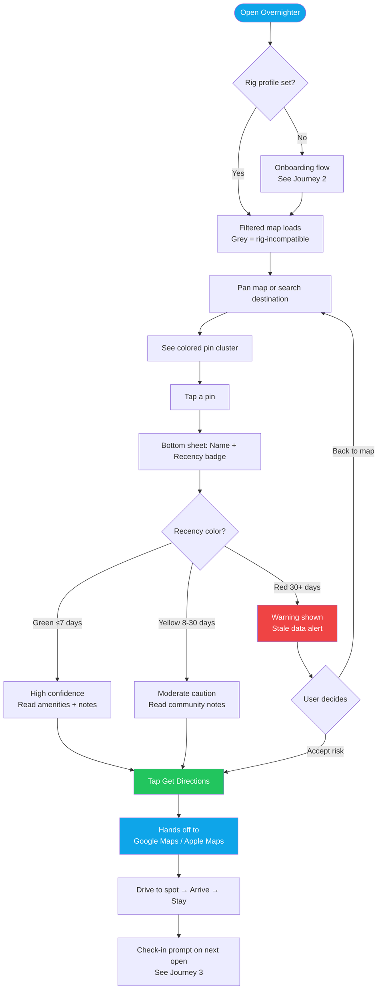
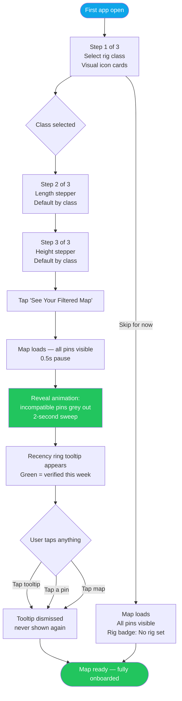
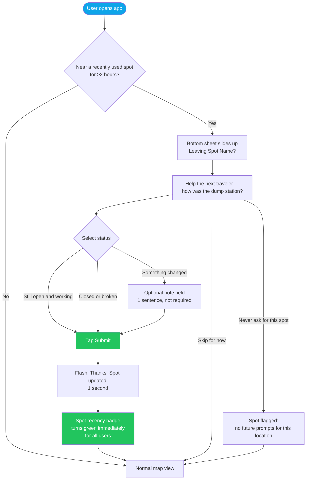
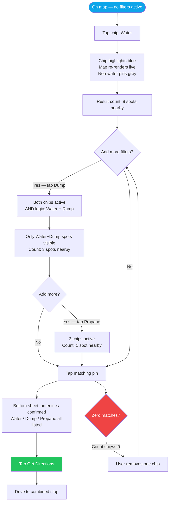
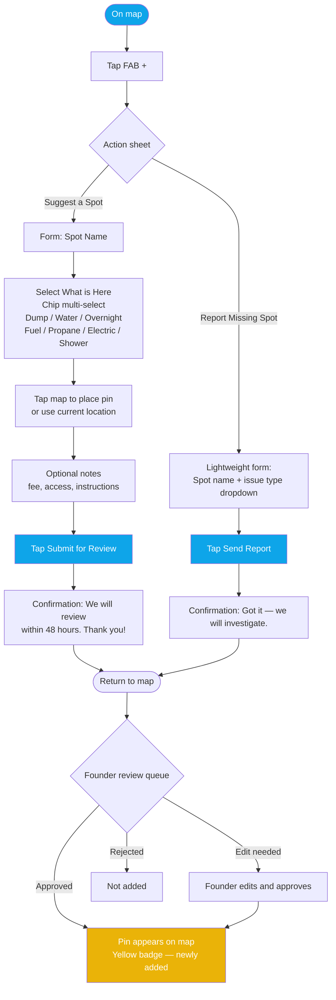

# UX Design Specification Overnighter

**Author:** Kyryl
**Date:** 2026-03-17

---

<!-- UX design content will be appended sequentially through collaborative workflow steps -->

## Executive Summary

### Project Vision

Overnighter is a mobile-first responsive web utility for full-time and
budget-conscious RVers. It replaces 4–5 fragmented apps with one rig-aware
map showing overnight parking, dump stations, water fills, and fuel — filtered
for the user's specific vehicle — with community-verified freshness signals as
the primary trust mechanism.

The product is Phase 0: no native app, no user accounts, localStorage rig
profile, API-sourced data. UX must deliver maximum value within these
constraints.

### Target Users

**Marcus — Primary (Full-Timer, Class A):**
Uses the app on travel days, likely from a phone mounted in the cab. Time-
pressured, operationally minded. Needs to plan overnight + dump + water in
under 10 minutes before getting on the road. Values accuracy over aesthetics.

**Sarah — Secondary (Boondocker, Van/Class B):**
Extended BLM stays, transitions every 5–14 days. Uses the app specifically to
plan the dump+water run before moving camp. Values off-grid spot discovery +
utility stop routing.

**Jamie — Secondary (New Full-Timer):**
Overwhelmed by current app fragmentation. First app experience must be
immediately clear and useful — zero prior mental model to rely on. Most likely
to convert if onboarding succeeds.

**Usage Context:** Mobile browser, often outdoors or in-vehicle, variable
connectivity, one-handed use likely during check-in.

### Key Design Challenges

1. **Map legibility on mobile** — Pin size, tap targets, and recency badge
   visibility must all work on a 6" screen, often in direct sunlight.

2. **Multi-amenity pin design** — A single location (e.g., a truck stop) may
   offer dump + water + fuel + overnight. One pin must convey this without
   clutter.

3. **Rig filter visual language** — Greyed-out inaccessible spots must
   communicate "filtered out" clearly without making the map feel broken or
   sparse.

4. **Departure check-in UX** — The 3-tap check-in prompt needs precise timing
   and framing to feel helpful, not intrusive — this is the data freshness
   engine.

5. **First-use trust moment** — Users arrive skeptical ("another app"). The
   rig profile → filtered map sequence must deliver an immediate visible payoff.

### Design Opportunities

1. **Recency badge as visual identity** — Green/yellow/red freshness is
   Overnighter's unique differentiator made visual. Design it to be unmissable
   and instantly understood — it can become the product's signature element.

2. **Rig profile onboarding as "aha" moment** — The instant the map re-renders
   filtered for their specific rig is the highest-value UX moment. Engineer
   this deliberately.

3. **Check-in as community contribution ritual** — Frame the departure prompt
   as "leave a note for the next traveler" rather than a form. Small copy and
   framing choices here directly drive data freshness.

---

## Core User Experience

### Defining Experience

The single most important interaction in Overnighter is:
**Search near destination → see rig-filtered map → tap best spot → navigate.**

This is Marcus's daily travel day loop — and it must complete in under 5 minutes
from opening the app to having a route in his maps app. Every design decision
should be evaluated against this core loop first.

### Platform Strategy

**Platform:** Mobile-first responsive web (Phase 0)
- No native app — browser-based, no installation required
- Touch-first interaction model: minimum 44px tap targets, swipe-friendly
- Device GPS via browser geolocation API for "Near Me"
- Works across iOS Safari, Android Chrome, and desktop browsers
- No offline capability in Phase 0 (deferred to Phase 1 premium feature)

**Constraints that shape design:**
- No push notifications (browser-only, not native)
- No background sync — app must be open to receive updates
- localStorage for rig profile persistence (no account required)
- Variable connectivity — maps must load progressively, not all-or-nothing

### Effortless Interactions

These interactions must require zero cognitive load — they should happen
instinctively:

1. **Rig profile setup** — Complete in under 60 seconds. 3 questions
   (class, length, height) with visual selectors, not text fields. Confirm
   and done. No account, no email, no password.

2. **"Near Me" search** — Single large tap. Map centers on current location
   immediately. No typing required for the most common use case.

3. **Check-in submission** — 3-tap max: open prompt → select status
   (Still open / Closed / Changed) → confirm. Optional note, never required.
   Must feel faster than skipping it.

4. **Get Directions** — One tap from pin detail launches native maps app
   with destination pre-filled. Zero friction between decision and navigation.

### Critical Success Moments

These are the moments where users either commit to Overnighter or abandon it:

| Moment | When it happens | What must happen |
|---|---|---|
| **The Rig Filter Reveal** | First time rig profile is saved | Map visibly re-renders — some spots grey out. User sees the filter is real. |
| **First Green Badge** | First spot found with recent verification | User reads "Verified 3 days ago" and trusts it over their old app |
| **Frictionless Navigation** | Tap "Get Directions" | Native maps opens instantly with correct destination — no copy-paste |
| **First Check-in Completed** | Departure from first saved spot | Prompt appears at the right moment, 3 taps, done — user feels like a contributor |
| **App Replacement Realization** | After 2–3 successful travel days | User notices they haven't opened Sanidumps or iOverlander |

### Experience Principles

These five principles guide every UX decision for Overnighter:

1. **Utility first, delight second** — Marcus doesn't need the app to be pretty.
   He needs it to be fast, accurate, and immediately useful. Never sacrifice
   utility for aesthetics. Every pixel earns its place by serving the core loop.

2. **Trust is visual** — The recency badge is not a feature — it's the product's
   primary value proposition made visible. It must be the dominant element on
   every pin, every time. Users should be able to assess data freshness without
   reading anything.

3. **One-handed, moving-vehicle ready** — Marcus may be using this while parked
   but not seated comfortably. Tap targets are large. No pinch-to-zoom required
   for core interactions. Critical actions reachable with the thumb.

4. **Rig-awareness is always on** — The rig filter is never a mode you toggle.
   It's always active, always visible in the UI as context, never something the
   user has to remember to turn on. Greyed spots remind users their rig is
   working for them silently.

5. **Community contribution is the last step of every trip** — The check-in
   prompt is not a separate "contribute" feature — it's the natural completion
   of using a spot. Design the departure flow as the closing ritual of a
   successful stay, not as a separate task.

---

## Desired Emotional Response

### Primary Emotional Goals

**Primary: Relief**
The dominant emotion Overnighter must deliver is relief — the release of daily
planning anxiety that full-time RVers carry. Marcus doesn't need the app to
be exciting. He needs it to make a stressful recurring task feel solved.

**Secondary: Trust**
The recency badge must create immediate data trust. Users arrive skeptical —
they've been burned by stale data before. Every green badge is a trust deposit.

**Tertiary: Belonging**
The check-in ritual should make contributors feel like part of a community
that takes care of each other on the road. "I'm leaving a note for the next
traveler" — not "I'm filling out a form."

### Emotional Journey Mapping

| Stage | Target Emotion | Design Driver |
|---|---|---|
| Opening the app | **Calm** — "this will be quick" | Fast load, clean map, no noise |
| Rig profile setup | **Impressed** — "it knows my rig" | Visual rig selector, instant map response |
| Seeing filtered map | **Relief** — only what matters | Greyed spots confirm filtering is working |
| Seeing green badge | **Trust** — "data is fresh" | Badge prominence, exact date visible |
| Tapping Get Directions | **Confidence** — committing to the plan | Seamless handoff to native maps |
| Arriving at correct spot | **Satisfaction** — it was right | No post-action UI needed |
| Departure check-in | **Belonging** — leaving a note | "Help the next traveler" framing |
| Day 3+ return use | **Habit comfort** — just Overnighter | Fast load, remembers rig, no re-setup |

### Micro-Emotions

**Critical to achieve:**
- **Confidence** over confusion — the rig filter status must always be visible
  so users never wonder "is it filtering for my rig right now?"
- **Trust** over skepticism — verification dates must be prominent, not buried
- **Accomplishment** over frustration — every core flow must complete in
  fewer steps than the user expects

**Critical to avoid:**
- **Anxiety** — never let users wonder if the rig filter is active
- **Confusion** — never show a map where grey spots aren't explained
- **Frustration** — never require more than 3 taps for check-in
- **Skepticism** — never show a pin without a recency signal

### Design Implications

| Emotional goal | UX design approach |
|---|---|
| **Relief** | Minimal UI, fast response, no unnecessary steps or decisions |
| **Trust** | Recency badge is the first thing visible on every pin — larger than pin title |
| **Confidence** | Persistent rig context indicator (e.g., "Filtering for: Class A, 35ft") always visible on map |
| **Belonging** | Check-in prompt copy: "How was [Spot Name] for your [rig class]? Help the next traveler." |
| **Habit comfort** | App opens to the map immediately — no splash, no re-onboarding, rig profile already applied |
| **Impressed** | Rig profile save triggers visible map animation — spots grey out in real time |

### Emotional Design Principles

1. **Solve the anxiety before the user feels it** — Load fast, show the rig
   filter status immediately, and display the nearest green-badged spot within
   the first 2 seconds of map render.

2. **Make trust visible, not readable** — Users should be able to judge data
   freshness from 3 feet away on a phone mount. Color + icon, never text-first.

3. **Earn belonging through framing, not features** — The check-in doesn't
   need to be a complex social feature. The right words ("help the next
   traveler") create community feeling without engineering complexity.

4. **Never let users feel abandoned** — When data is stale (red badge) or
   spots are filtered out, explain why with one sentence. Silence breeds
   anxiety; a single explanatory label builds trust.

---

## UX Pattern Analysis & Inspiration

### Inspiring Products Analysis

#### Google Maps — Navigation & Pin Interaction Model
**What it does well for our users:**
- The tap-pin → info sheet → directions flow is universal muscle memory
- Bottom sheet pattern for location details is standard and expected on mobile
- "Near me" search is a single tap — no typing for the most common query
- Progressive disclosure: minimal info on pin, full detail on tap

**What we adopt directly:** The bottom sheet pin detail pattern. Users will
expect this. Don't reinvent it — invest the design effort elsewhere.

#### iOverlander — Community Spot Map (Pre-Shutdown)
**What it does well:**
- Established the mental model: map of user-contributed spots with photos
  and community notes
- Category icons on pins (camp, water, fuel) — users understand this language
- Community-first data model — users trust peer reports over official data

**What it did poorly (our advantage):**
- No rig filtering — all spots shown for all vehicles
- No recency signal — no way to know if data is current
- 97% passive users — no mechanism to make contribution feel worthwhile
- Cluttered UI — no information hierarchy

**What we adopt:** The category icon language (camp/dump/water/fuel icons
users already know). What we improve: recency as primary signal, rig filter
as core layer, contribution as ritual not afterthought.

#### Waze — Community Contribution Model
**What it does well:**
- Departure-style reporting: you report something AS you're leaving/passing
- 3-tap contribution: tap hazard type → confirm → done. Feels fast.
- Community reciprocity is implicit: you get warnings because others reported
- The "thanks" moment after your report is used — small but meaningful

**What we adopt:** The departure-triggered, 3-tap contribution model. The
framing of "you're helping others right now" as the motivator. The implicit
reciprocity loop (you benefit because others report; others benefit when you
report).

#### Sanidumps / AllStays — What Not To Do
**What they do poorly:**
- Static data with no freshness signal — users don't know how old info is
- Desktop-first UX ported badly to mobile — small tap targets, cluttered
- No rig context — shows everything regardless of vehicle
- No onboarding — drops users directly into a confusing map

**Anti-patterns to avoid directly from these apps:**
- Tiny tap targets on map pins
- Information overload on the map layer
- No explanation of why data might be wrong/outdated
- Requiring account creation before showing any value

### Transferable UX Patterns

**Navigation Patterns:**
- **Google Maps bottom sheet** → adopt for pin detail view. Bottom sheet
  slides up on pin tap, showing amenities, recency, fee, and Get Directions.
  Swipe down to dismiss. Universal and expected.
- **Waze floating action buttons** → adapt for "Near Me" + layer toggles.
  Large, thumb-reachable floating buttons for the 2 most common actions.

**Interaction Patterns:**
- **Waze 3-tap hazard report** → adopt exactly for check-in flow. Tap prompt
  → select status (3 options) → confirm. Optional note below the fold.
- **Google Maps "share location" handoff** → adopt for Get Directions. Single
  tap opens native maps with coordinates pre-filled. No intermediate screen.
- **iOverlander category icons** → adapt with recency color overlay. Users
  already know tent = camp, water drop = water, etc. Add the green/yellow/red
  recency ring around the icon rather than replacing the icon language.

**Visual Patterns:**
- **Traffic light color system** (Waze, Google Maps) → adopt for recency
  badges. Green/yellow/red is universal, learned, requires zero explanation.
- **Greyed-out unavailable items** (Airbnb unavailable dates, Google Maps
  closed businesses) → adopt for rig-filtered spots. Users already understand
  grey = not for you right now.

### Anti-Patterns to Avoid

1. **The iOverlander clutter trap** — showing everything at once with no
   hierarchy. Our map must have a clear visual hierarchy: recency badge >
   amenity type > spot name. Most map apps fail this.

2. **The Sanidumps "trust me" problem** — displaying data with no freshness
   context. Every pin must have a recency signal. No exceptions. Unknown = red.

3. **The AllStays registration gate** — requiring account creation before
   showing value. We show the full map immediately. Rig profile setup is
   optional friction the user chooses for a clear visible benefit.

4. **The Waze notification fatigue** — over-prompting for contributions.
   Check-in prompt appears once per stay, at departure. Never mid-stay,
   never repeated, never pushed during planning.

5. **The Google Maps "everything" problem** — showing irrelevant pins.
   Our rig filter is always on. Users should never see a spot that doesn't
   apply to them as an active option (grey = filtered, not hidden).

### Design Inspiration Strategy

**Adopt directly:**
- Google Maps bottom sheet for pin detail
- Traffic light (green/yellow/red) for recency
- Grey-out pattern for rig-filtered spots
- Single-tap "Get Directions" handoff to native maps

**Adapt:**
- iOverlander category icons + add recency color ring overlay
- Waze 3-tap contribution flow → apply to departure check-in
- Waze "helping others" framing → apply to check-in copy

**Avoid entirely:**
- Account-first onboarding gates
- Static data without freshness context
- Desktop-ported map UX with small tap targets
- Contribution friction requiring typing or long forms

---

## Design System Foundation

### Design System Choice

**Selected: Tailwind CSS + shadcn/ui (Themeable System)**

Tailwind CSS as the utility framework with shadcn/ui for accessible component
primitives. Custom design tokens for Overnighter's unique visual elements
(recency badge colors, pin design, rig filter indicator).

### Rationale for Selection

1. **Solo dev velocity** — Tailwind's utility classes eliminate context-switching
   between CSS files. shadcn/ui provides copy-paste accessible components
   (bottom sheets, dialogs, buttons) that are owned by the project, not locked
   in a dependency.

2. **Full control where it matters** — The recency badge (green/yellow/red),
   pin design, and rig filter indicator are Overnighter's visual signatures.
   Tailwind gives complete control over these without fighting a design system's
   defaults.

3. **Standard patterns where it doesn't** — Form inputs, buttons, modals, and
   navigation use shadcn/ui defaults. No time spent reinventing accessible
   components.

4. **Map-first architecture compatibility** — The map canvas (Leaflet or Mapbox)
   handles its own rendering. Tailwind/shadcn sits around the map, not on top
   of it. Clean separation.

5. **Phase 0 timeline** — 6–8 weeks. Tailwind is the fastest path to a
   polished, consistent UI without a design team.

### Implementation Approach

**Design tokens (custom Tailwind config):**
- `fresh`: #22c55e (green-500) — verified < 7 days
- `recent`: #eab308 (yellow-500) — verified 8–30 days
- `stale`: #ef4444 (red-500) — verified 30+ days or unknown
- `filtered`: #9ca3af (gray-400) — rig-filtered spots
- `primary`: deep navy or dark teal (TBD in brand pass)

**shadcn/ui components to use:**
- `Sheet` (bottom sheet) → pin detail view
- `Dialog` → check-in prompt
- `Button` → all interactive elements (large, touch-friendly variant)
- `Badge` → recency indicator
- `Select` → rig profile setup

**Custom components (Tailwind only, no shadcn):**
- Map pin with recency ring and amenity icon
- Rig filter status bar (persistent map overlay)
- Check-in 3-tap selector
- Onboarding rig profile step flow
- "Suggest a Spot" 4-field submission form + map tap coordinate picker
- "Missing a spot here?" lightweight report trigger

### Customization Strategy

The visual identity for Overnighter is built on two distinctive elements:

1. **The recency ring** — Every map pin has a colored ring (green/yellow/red)
   as its outermost element. This is the brand's most recognizable visual.
   Custom SVG component, not a shadcn badge.

2. **The dark map aesthetic** — Dark basemap (Mapbox dark style or OpenStreetMap
   dark variant) makes the colored recency rings pop visually. The UI chrome
   matches: dark backgrounds with high-contrast action elements.

**Spot contribution UX (MVP):**
Two entry points, two levels of effort, both feed the founder review queue:
- **"+" FAB** on map → "Suggest a Spot" — 4-field form (name, type, location
  auto-filled from tap, notes). Submits to review queue. "We'll review within
  48 hours."
- **"Missing a spot here?"** link on empty-area tap → lightweight flag (name +
  type only). Even lower friction for users who just want to flag something
  quickly.

All community submissions remain in pending state until founder approval.
No public moderation UI needed in Phase 0.

---

## 2. Core User Experience

### 2.1 Defining Experience

**"Tap the green pin, trust it, go."**

The defining interaction is: spot a green-ringed pin near the destination →
tap it → read the bottom sheet (verified X days ago, Class A accessible, $5
fee) → tap Get Directions → drive.

This interaction must complete in under 4 taps and under 10 seconds from map
open to navigation launch. If it takes longer, the product has failed its core
promise.

Everything else in the product — rig profile, check-ins, spot suggestions —
exists to make this 4-tap sequence trustworthy and repeatable.

### 2.2 User Mental Model

Users arrive with a fully-formed map mental model from Google Maps, Waze, and
iOverlander. They know:
- Pins on a map = places
- Tap pin = see details
- Tap details = get directions
- Icons = categories (camp, dump, water)

**What's new:** The recency ring. Users have never seen a colored ring around
a map pin that means "this was verified 3 days ago." This is the only new
concept requiring a brief first-use explanation (one tooltip, max).

**What breaks their current mental model:** Multi-app switching. They currently
context-switch between 4–5 apps for one task. Overnighter's job is to short-
circuit that habit by making everything available in one map layer.

### 2.3 Success Criteria

The core experience succeeds when:

| Criterion | Measure |
|---|---|
| Speed | Map open → Get Directions tapped in < 10 seconds |
| Trust | User acts on first green-badged result without cross-checking another app |
| Clarity | User understands recency ring color meaning without reading help text (after first use) |
| Completion | Get Directions successfully launches native maps with correct coordinates |
| Return | User opens Overnighter first on next travel day (not a backup app) |

### 2.4 Novel UX Patterns

**The recency ring (novel):**
A colored ring around map pins indicating data freshness — green < 7 days,
yellow 8–30 days, red 30+ days. No direct precedent in existing RV apps.
Adjacent pattern: traffic light status indicators (universally understood).

**Teaching strategy:** First-time map view shows a single non-intrusive
tooltip: "🟢 Green = verified this week. Tap any pin to see when." Dismisses
on first tap. Never shown again.

**Everything else (established):**
- Bottom sheet for pin detail → Google Maps pattern
- Get Directions handoff → standard deep link
- Category icons (tent/water/dump/fuel) → iOverlander visual language
- Grey-out for filtered spots → Airbnb/Google Maps pattern
- 3-tap check-in → Waze hazard report pattern
- FAB for spot suggestion → Google Maps "add a missing place" pattern

### 2.5 Experience Mechanics

#### Primary Flow: Find → Verify → Navigate

**1. Initiation:**
User opens app → map loads centered on current location (or last search) →
rig filter already applied (remembered from localStorage) → pins render with
recency rings visible immediately

**2. Interaction:**
- User scans map for green rings near destination
- Pinch/zoom or search to move to destination area
- Taps a green-ringed pin matching their need (overnight, dump, water)
- Bottom sheet slides up: name, amenity icons, recency ("Verified 3 days ago"),
  fee, rig note ("Class A accessible, pull-through"), community notes

**3. Feedback:**
- Recency ring color = immediate data trust signal (no reading required)
- Bottom sheet shows exact verification date + who verified (device type, not name)
- Greyed pins with "filtered for your Class A" tooltip on first long-press

**4. Completion:**
- "Get Directions" button at bottom of sheet → opens native maps app
- Sheet dismisses, user is in navigation
- On next app open after staying: departure check-in prompt appears

#### Secondary Flow: Suggest / Report Missing Spot

**1. Initiation:**
- FAB "+" button (bottom right) → "Suggest a Spot" form
- OR: tap empty map area → bottom sheet shows "Nothing here yet. Missing a
  spot?" → lightweight report

**2. Interaction (Suggest a Spot):**
- Location auto-filled from map tap point (adjustable pin drop)
- 4 fields: name, type (multi-select: overnight/dump/water/fuel), notes,
  confirm location
- Submit → "Thanks! We'll review and add it within 48 hours."

**3. Interaction (Report Missing):**
- 2 fields: spot name, type
- Submit → "Got it, thanks for helping the map."

**4. Completion:**
- Submission enters founder review queue (pending state, not public)
- No confirmation tracking needed in Phase 0 — founder manages manually

---

## Visual Design Foundation

### Color System

**Recency Signal Colors (brand-defining, fixed):**
| Token | Hex | Usage |
|---|---|---|
| `fresh` | #22c55e | Verified < 7 days — dominant green ring |
| `recent` | #eab308 | Verified 8–30 days — caution yellow ring |
| `stale` | #ef4444 | Verified 30+ days or unknown — alert red ring |
| `filtered` | #6b7280 | Rig-filtered/inaccessible spots |

**UI Chrome (dark theme):**
| Token | Hex | Usage |
|---|---|---|
| `background` | #0f172a | App background, map overlay areas |
| `surface` | #1e293b | Bottom sheet, cards, panels |
| `surface-raised` | #334155 | Elevated elements, hover states |
| `border` | #475569 | Dividers, input borders |
| `text-primary` | #f1f5f9 | Main readable text |
| `text-secondary` | #94a3b8 | Labels, secondary info |
| `text-muted` | #64748b | Placeholder, disabled, timestamps |

**Brand Accent:**
| Token | Hex | Usage |
|---|---|---|
| `primary` | #0ea5e9 | Buttons, links, active states, FAB |
| `primary-dark` | #0284c7 | Pressed/active button states |

Rationale: Dark theme makes recency rings visually dominant on the map.
Sky-blue accent reads as "open sky / open road" — thematically appropriate
and clearly distinct from all recency colors.

### Typography System

**Font:** Inter (Google Fonts) with system fallback `-apple-system, sans-serif`

| Scale | Size | Usage |
|---|---|---|
| `text-xs` | 12px | Map pin labels, badges |
| `text-sm` | 14px | Search results, list items |
| `text-base` | 16px | Body text, pin detail sheet |
| `text-lg` | 18px | Sheet titles, section headers |
| `text-xl` | 20px | Onboarding step titles |
| `text-2xl` | 24px | Page-level headers only |

Line height: `leading-relaxed` (1.625) for body, `leading-tight` (1.25) for
map labels and badges. Font weight: 400 body, 600 labels, 700 headings.

### Spacing & Layout Foundation

**Base unit:** 4px (Tailwind default scale)

| Context | Value | Notes |
|---|---|---|
| Minimum tap target | 44×44px | WCAG 2.5.5 / Apple HIG |
| Component padding | 12–16px | Internal card/sheet padding |
| Section spacing | 24px | Between major layout sections |
| Map edge clearance | 16px | FAB and floating UI from screen edge |
| Bottom sheet padding | 24px horizontal, 20px vertical | |
| Pin size | 32×32px minimum | Ensures tap target with ring |

**Layout approach:** Single-column on mobile. Map occupies full screen.
Bottom sheet overlays from bottom. No sidebar navigation — all actions
surface contextually from the map or via FAB.

### Accessibility Considerations

- All text/background combinations meet WCAG AA contrast (4.5:1 minimum)
- Recency colors supplemented with icons (not color-only signals):
  ✓ green ring + checkmark icon, ⚠ yellow + clock icon, ✕ red + warning icon
- Minimum 44px tap targets on all interactive elements
- Inter font chosen for dyslexia-friendly letterforms
- Dark theme reduces eye strain in bright outdoor conditions
- Touch target spacing: minimum 8px between adjacent tappable elements

---

## User Journey Flows

### Journey 1: Find → Verify → Navigate (Core Daily Loop)

Marcus opens the app on a travel day. Every interaction is optimized for a driver who needs answers in 5 minutes, not 30.



**Key optimizations:**
- Bottom sheet appears without transition delay — map dims slightly behind it
- Get Directions is the only primary button — one tap to exit into navigation
- Red pin still shows Get Directions (user's choice) — Overnighter warns, never blocks

---

### Journey 2: First-Time Onboarding (The Reveal)

The "aha moment" is the map re-rendering as grey pins filter out. Every second of friction before it costs conversion.



**Key optimizations:**
- Steps 1–3 are all tap — no keyboard, under 60 seconds total
- Defaults pre-filled by class (Class A → 35ft / 12'6") — user fine-tunes only if needed
- Skip path always available — never block a user from the map
- The reveal animation is the product selling itself in 2 seconds

---

### Journey 3: Departure Check-In (Community Flywheel)

The data loop that keeps the product alive. Friction = zero contribution. 3 taps maximum.



**Key optimizations:**
- Never shown mid-stay — only on re-open after ≥2 hours at a known spot
- "Something changed" expands note field inline — no new screen
- "Never ask for this spot" prevents false triggers at home base or frequent stops
- Success flash lasts 1 second — immediate return to map, no ceremony

---

### Journey 4: Amenity Filter (Multi-Chip AND Logic)

"Before I leave this BLM spot I need water AND a dump. Both. Not one or the other."



**Key optimizations:**
- Chips re-render map inline — no page change, no load state visible to user
- Zero-match state shows "0 spots" as an invitation to adjust, not as an error
- Active chips show ✕ — tap again to deactivate, no separate clear button needed

---

### Journey 5: Suggest a Spot (Community Growth)

Phase 0: founder reviews every submission. 4 fields, map pin tap, 48-hour turnaround.



---

### Journey Patterns

**Navigation Pattern — Map → Sheet → Action:**
Every journey routes through map interaction → bottom sheet → single primary action. No full-page transitions in the core use case. The map is always the home screen — all flows emerge from it and return to it.

**Decision Pattern — Color as Signal:**
Green / yellow / red recency drives confidence decisions without requiring users to read text. Color is the decision interface; text confirms it. This applies to pin rings, badge labels, and the onboarding reveal animation.

**Feedback Pattern — Flash + Immediate State Change:**
Every submission gets a 1-second flash confirmation followed by immediate visible state change (badge turns green, chip activates, count updates). No spinner with ambiguous result. Users see the effect of their action before the flash clears.

**Recovery Pattern — Warn, Never Block:**
Stale data (red badge) warns but never prevents action. Zero-match filter state shows count "0" as an invitation to adjust — not an error screen. Users are trusted to make their own decisions.

---

### Flow Optimization Principles

1. **4 taps to directions, maximum** — Open app → tap pin → read sheet → Get Directions. Never more steps than this.
2. **Chip state is map state** — Amenity chips directly control pin visibility with no intermediate step or load screen.
3. **Contribute in context** — Check-in appears when you're actually leaving a spot, not as a push notification hours later.
4. **Every dismiss is permanent** — Tooltip shown once. Never-ask respected. No re-prompting. Users trust that dismissed UI stays dismissed.
5. **Skip is always available** — Onboarding, check-in, suggest a spot — all skippable. Overnighter earns contribution, never demands it.

---

## Component Strategy

### Map Stack

**Tile layer:** OpenStreetMap (`https://{s}.tile.openstreetmap.org/{z}/{x}/{y}.png`)
Free, no API key required. Attribution `© OpenStreetMap contributors` mandatory (Leaflet handles automatically).

**Map library:** Leaflet.js
`L.map()` for the main map instance, `L.tileLayer()` for OSM tiles.

**Dark tile layer (recommended):** CartoDB Dark Matter
`https://{s}.basemaps.cartocdn.com/dark_all/{z}/{x}/{y}{r}.png`
Free, no API key, matches dark slate design system. Use instead of inverting OSM light tiles.

### Design System Components (shadcn/ui)

| Component | Used for |
|---|---|
| `Button` | Get Directions CTA, form submits, onboarding Next |
| `Sheet` | Bottom sheet base (SpotBottomSheet, CheckInSheet) |
| `Badge` | RecencyBadge base |
| `Input` | Spot name, notes fields in suggest form |
| `Textarea` | Check-in "something changed" note field |
| `Toast` | Flash confirmations ("Thanks! Spot updated.") |
| `Tooltip` | First-time recency ring explanation |
| `Toggle` | Layer toggle (Camp/Dump/Water on/off) |
| `Dialog` | Suggest/Report action sheet |

### Custom Components

#### `RecencyPin`

**Purpose:** Map pin with colored recency ring — the product's primary visual identity. Every spot on the map is this component.

**Implementation:** Leaflet `L.DivIcon` with custom HTML/CSS. Not `L.CircleMarker` (can't embed emoji icon). Not default `L.Marker` (wrong shape).

```js
const icon = L.divIcon({
  className: '',
  html: `<div class="pin-ring ${recencyClass}">${categoryEmoji}</div>`,
  iconSize: [36, 36],
  iconAnchor: [18, 18]
})
L.marker([lat, lng], { icon })
  .on('click', () => onPinSelect(spotId))
  .addTo(map)
```

**States:**

| State | Ring color | Fill | Opacity |
|---|---|---|---|
| fresh (≤7 days) | #22c55e | rgba(34,197,94,0.15) | 100% |
| recent (8–30 days) | #eab308 | rgba(234,179,8,0.15) | 100% |
| stale (30+ days) | #ef4444 | rgba(239,68,68,0.15) | 100% |
| filtered (rig-incompatible) | #6b7280 | rgba(107,114,128,0.1) | 50% + grayscale(1) |
| selected | inherited + scale(1.2) | inherited | 100% |

**Performance:** Use `L.layerGroup()` per category (Camp / Dump / Water / Fuel / Propane). Toggle visibility with `addTo(map)` / `remove()` — faster than re-rendering individual markers. For 500+ pins, add `leaflet.markercluster` plugin (Phase 2).

**Accessibility:** `aria-label="[Spot name], verified [X] days ago, [recency]"` on each marker — never color-only.

---

#### `SpotBottomSheet`

**Purpose:** The tap-to-verify moment. Slides up from bottom when a pin is tapped.

**Base:** Extends shadcn `Sheet`.

**Anatomy:**
1. Drag handle
2. Spot name (17px bold)
3. `RecencyBadge` — first element below name
4. Amenity pills row (scrollable horizontal)
5. Meta text (class compatibility, notes, last comment)
6. Get Directions primary button (full width)

**States:** `loading` (skeleton), `fresh` (green badge), `stale` (red badge + warning), `rig-compatible` (blue note).

**Accessibility:** `role="dialog"`, `aria-label="Spot details"`, dismissible with swipe-down.

---

#### `RecencyBadge`

**Purpose:** Inline color + icon + text trust signal inside SpotBottomSheet.

**Base:** Extends shadcn `Badge`.

| State | Background | Color | Icon |
|---|---|---|---|
| fresh | rgba(34,197,94,0.15) | #22c55e | ✓ |
| recent | rgba(234,179,8,0.15) | #eab308 | 🕐 |
| stale | rgba(239,68,68,0.15) | #ef4444 | ⚠ |

Icon always present — never color-only.

---

#### `RigBadge`

**Purpose:** Always-visible confirmation that rig filter is active. Eliminates anxiety about whether filtering is on.

**Anatomy:** `[icon] [Class] · [Xft] · [status]` — e.g. `🚐 Class A · 35ft · Filtered`

**States:** `active` (sky-blue border+text), `no-rig` (grey, "No rig set" — invites setup).

**Position:** Fixed top-left, below search bar. Always visible. Entire badge tappable → opens rig settings.

---

#### `FilterChipBar`

**Purpose:** Horizontal scrollable amenity filter row. Always visible below search bar. Multi-select with live map binding.

**Implementation:** Built from scratch — no shadcn equivalent.

**Chip order:** 💧 Water · 🚽 Dump · 🏕 Overnight · ⛽ Fuel · 🔵 Propane · ⚡ Electric · 🚿 Shower

**FilterChip states:**
- `inactive` — dark surface, grey text, grey border
- `active` — sky-blue background, white text + ✕ to clear

**AND logic:** Multiple active chips filter to spots that have ALL selected amenities.

**Result count:** When chips active, floating `ResultCount` pill shows "X matching spots nearby" — updates live.

---

#### `StepperInput`

**Purpose:** Precise numeric entry for rig length and height. No keyboard, no slider imprecision.

**Implementation:** Built from scratch.

**Anatomy:** `[− 48px button] [value display] [+ 48px button]`

**Formats:** `35 ft` (length, 1ft increments, 16–60ft) · `12 ft 6 in` (height, 1in increments, 7'0"–14'0")

**Default values by rig class:**

| Class | Length | Height |
|---|---|---|
| Class A | 35ft | 12'6" |
| Class B / Van | 22ft | 9'0" |
| Class C | 28ft | 11'0" |
| Travel Trailer | 30ft | 11'6" |

---

#### `CheckInSheet`

**Purpose:** Departure-triggered 3-tap community contribution.

**Base:** Extends shadcn `Sheet`.

**Anatomy:** Title "Leaving [Spot]?" → prompt → 3 `CheckInOption` rows → Submit → Skip → Never ask link.

**CheckInOption states:** `default` (dark border) / `selected` (green border + tint).

**Submission:** `onCheckInSubmit(spotId, status, note?)` → Toast confirmation → pin badge updates green.

---

#### `SuggestSpotForm`

**Purpose:** Full-screen 4-field spot contribution form.

**Anatomy:** Spot name → What's here? chips → `MapPinPicker` → Notes (optional) → Submit for Review.

**Validation:** Name required + ≥1 chip + pin placed. Inline error on submit attempt only.

---

#### `MapPinPicker`

**Purpose:** Inline Leaflet map for tap-to-place pin in the suggest form.

**Implementation:** Second independent `L.map()` instance in a 100px container.

```js
const picker = L.map('pin-picker-container', {
  zoomControl: false,
  attributionControl: false,
  scrollWheelZoom: false  // prevent scroll hijack inside form
})
L.tileLayer('https://{s}.basemaps.cartocdn.com/dark_all/{z}/{x}/{y}{r}.png').addTo(picker)
picker.on('click', (e) => placePin(e.latlng))
```

**States:** `empty` (crosshair + "Tap to set location") / `location-set` (pin + lat/long shown) / `using-current` (GPS icon + "Using your location").

---

### Component Implementation Strategy

All custom components use Tailwind CSS tokens from Step 6. Zero additional UI library dependencies beyond shadcn/ui and Leaflet.js.

**Composition principle:** Custom components wrap shadcn/ui primitives where possible.
- `SpotBottomSheet` / `CheckInSheet` → extend shadcn `Sheet`
- `RecencyBadge` → extends shadcn `Badge`
- `FilterChipBar`, `RecencyPin`, `StepperInput`, `MapPinPicker` → built from scratch

### Implementation Roadmap

**Phase 1 — Core Journey (MVP blocking):**
1. `RecencyPin` — map non-functional without it
2. `SpotBottomSheet` + `RecencyBadge` — the trust moment
3. `RigBadge` — always-visible filter confirmation
4. `FilterChipBar` + `FilterChip` — amenity filtering
5. `StepperInput` — onboarding dimensions entry

**Phase 2 — Community Flywheel:**
6. `CheckInSheet` — departure check-in
7. `SuggestSpotForm` + `MapPinPicker` — spot contribution
8. `ReportMissingForm` — lightweight 2-field report

**Phase 3 — Polish:**
9. Onboarding reveal animation (pin grey-out sweep)
10. First-time recency tooltip (shadcn `Tooltip`, minimal effort)
11. `ResultCount` pill with animated count update

---

## UX Consistency Patterns

### Button Hierarchy

**Primary** — one per screen/sheet, full width in sheets, sky-blue (#0ea5e9)
- `Get Directions →` · `Submit for Review` · `Next →` · `Submit (takes 5 sec)`
- Never more than one primary button visible at a time

**Secondary** — text-only or outlined, never competing with primary
- `Skip for now` · `← Back` · `Use current location`
- Font size 12–13px, muted text color (#94a3b8), no border

**Destructive-adjacent** — plain text, smallest size, only when irreversible
- `Never ask for this spot`
- Color: #64748b (text-muted) — present but not prominent

**Disabled state:** opacity 0.4, `cursor: not-allowed`. Used only when a required action is genuinely incomplete (e.g. Submit before pin placed in SuggestSpotForm).

---

### Feedback Patterns

**Success flash (Toast):**
- Duration: 1 second, auto-dismiss
- Position: centered top, slides down from top edge
- Style: green-tinted surface, ✓ icon + one-line message
- Examples: `"Thanks! Spot updated."` · `"Submitted for review."`
- No action button — pure confirmation, never interrupts flow

**Immediate state change:**
- Every submit fires both a Toast AND a visible state change simultaneously
- Pin badge turns green · Chip activates · Count updates
- State change is the real feedback; Toast is the acknowledgement

**Warning (stale data):**
- Inline inside SpotBottomSheet, not a blocking modal
- Red RecencyBadge + one-line warning text above the CTA
- Get Directions still available — warn, never block

**Error (form validation):**
- Inline below the problem field, shown only on submit attempt
- Red border on field + 12px red helper text
- Never real-time validation — fires only when user taps Submit

---

### Form Patterns

**Chip multi-select (amenity pickers):**
- Tap = toggle. No confirmation step.
- Active state: sky-blue background + white text
- At least one required → Submit disabled + red helper text if attempted with zero selected

**Text input fields:**
- Placeholder text in #475569 (readable, not ghost)
- Active state: sky-blue border
- Static labels above each field — no floating labels

**Optional vs required:**
- Required fields: no special marker (all assumed required unless noted)
- Optional fields: `(optional)` appended to label in grey
- Notes / free-text fields are always optional

**StepperInput tap targets:** +/− buttons always 48×48px minimum. Value display is not tappable.

---

### Navigation Patterns

**Map is always home:**
- No persistent tab bar, no hamburger nav
- Every flow starts from the map and returns to it
- "Back" always means "return to map"

**Bottom sheet navigation:**
- Tap pin → sheet slides up from bottom
- Swipe down or tap backdrop → sheet dismisses
- Sheet never covers full screen — map chrome partially visible at top

**Back arrow:**
- Present only in full-screen flows (SuggestSpotForm, Onboarding)
- Top-left, 18px `←`, color #94a3b8
- Always goes exactly one level back

**No browser back button dependency:**
- App manages its own navigation state
- Browser back dismisses active sheet or returns to map — never navigates to a previous page

---

### Modal and Overlay Patterns

**Bottom sheet (primary overlay):**
- Max height: 60% of screen for compact, 80% for full-detail sheets
- Always has drag handle (36×4px, centered, #475569)
- Background: #1e293b with border-top: 1px solid #334155
- Always dismissible — no locked sheets

**Action sheet (FAB + → choice):**
- 2 options max (Suggest a Spot / Report Missing)
- Tap option → navigate to that flow · Tap backdrop → dismiss

**No full-screen modals in core flows:**
- All overlays are bottom sheets, not centered dialogs
- Centered dialogs only for destructive confirmations if needed in future

---

### Loading and Empty States

**Map loading:** Leaflet tile progressive loading — no custom loader needed. Pins render after tiles.

**No pins in current area:**
- Subtle centered message: `"No spots found here yet — zoom out or add one"`
- FAB `+` still visible — direct call to action

**Zero filter results:**
- Result count shows `"0 matching spots"` in red (#ef4444)
- No empty-state screen — chips stay visible, hint: `"Try removing a filter"`

**Form submission loading:**
- Submit button shows spinner + disabled state while in-flight
- If >2 seconds: Toast error `"Something went wrong. Try again."`

---

### Search and Filter Patterns

**Search bar:**
- Always visible at top of map, floating above tiles
- Placeholder: `Search destination or "near me"`
- Clear `×` appears when text entered
- Results: map re-centers — no separate results list

**Amenity chip filter (FilterChipBar):**
- Always visible below search bar
- Tap chip = immediate map re-render, no delay
- Active chips scroll to front on activation
- Horizontal scroll only — chips never wrap to two lines
- Rig filter and amenity chips are additive — both apply simultaneously

---

### Interaction Micro-Patterns

**Tap targets:** Minimum 44×44px. Adjacent targets: minimum 8px gap.

**Press feedback:** Immediate — `opacity: 0.8` on tap for icon buttons, background darken on chips/buttons. No delay.

**Scroll shadows:** Horizontal scrollable rows show right-edge fade gradient when overflow exists.

**Dismiss on outside tap:** All bottom sheets dismiss on backdrop tap. No explicit close button required.

**One-time UI:** First-time tooltip and onboarding shown once, tracked in localStorage, never repeated.

---

## Responsive Design & Accessibility

### Responsive Strategy

**Mobile (320–767px) — Primary target, designed first**

The "on the road" experience — used while parked, on a phone, often one-handed, sometimes in bright sunlight.
- Full-screen map, floating UI elements, bottom sheets edge-to-edge
- Single column throughout — no sidebars
- Thumb zone priority: primary actions in the bottom 40% of screen
- Bottom sheets expand from bottom — natural thumb reach

**Tablet (768–1023px) — Secondary, trip pre-planning**

Used at a campsite table, planning the next leg. More screen, less urgency.
- Map still full-screen
- Bottom sheets max-width 480px, centered horizontally
- Same components, better breathing room — no new layout introduced

**Desktop (1024px+) — Tertiary, pre-trip research**

Used at home before a trip. Mouse + keyboard.
- Split view: map ~65% left, spot detail panel ~35% right
- SpotBottomSheet becomes a right sidebar panel (same content, different position)
- Mouse hover state on RecencyPins: slight scale + `cursor: pointer`
- Keyboard navigation for all core flows

### Breakpoint Strategy

Standard Tailwind breakpoints — no custom additions needed for MVP. Mobile-first approach: base CSS = mobile, breakpoints add layout.

| Breakpoint | Width | Layout change |
|---|---|---|
| base (mobile) | 320–639px | Single column, bottom sheets edge-to-edge |
| `sm` | 640px+ | Bottom sheets max-width 480px, centered |
| `md` | 768px+ | Tablet touch target and spacing optimizations |
| `lg` | 1024px+ | Desktop split view, right panel for spot detail |
| `xl` | 1280px+ | Map expands, panel stays 360px fixed width |

**Desktop split view (`lg`+):**
```
┌──────────────────────────────────────────────────────┐
│  [Search bar                   ]   [Rig badge]       │
│  [💧 Water][🚽 Dump][🏕 Overnight][⛽ Fuel][🔵 Prop] │
├──────────────────────────────┬───────────────────────┤
│                              │  Spot Detail Panel    │
│       Leaflet Map            │  Name + RecencyBadge  │
│         (65%)                │  Amenities + Meta     │
│                              │  [Get Directions →]   │
│  [Legend]  [FAB +] [📍]      │       (35%)           │
└──────────────────────────────┴───────────────────────┘
```

### Accessibility Strategy

**Target: WCAG 2.1 AA**

AA is the right level for MVP — it is the legal standard in most jurisdictions and covers all meaningful requirements without engineering heroics.

**Product-specific accessibility challenges:**

**Color blindness + recency ring system**
~8% of males have color vision deficiency. Mitigation:
- Every recency state has both a color AND an icon (✓ green / 🕐 yellow / ⚠ red)
- Every `RecencyPin` has an `aria-label` with text recency ("verified 3 days ago")
- Color is never the only signal

**Outdoor / bright sunlight readability**
Dark theme (#0f172a base) with high-contrast elements (#f1f5f9 text) provides better outdoor readability than a light theme. All text/background pairs target ≥4.5:1 contrast ratio.

**One-handed use**
Primary interactions — tapping pins, reading sheets, Get Directions — are reachable with one thumb in the bottom 40% of the screen. Search bar at top is a secondary action.

**Screen reader compatibility (map layer)**
Leaflet maps are not natively screen-reader friendly. Mitigation:
- Every pin marker: `aria-label="[Spot Name], [category], verified [X] days ago, [recency]"`
- SpotBottomSheet: `role="dialog"`, `aria-labelledby` pointing to spot name
- Map container: `aria-label="Overnighter map — [N] spots visible"` updated on filter change
- FilterChips: `role="checkbox"` + `aria-checked`
- FAB: `aria-label="Add a spot"` (not just "+")

### Testing Strategy

**Real device testing (not only emulator):**
- iPhone Safari — primary iOS target
- Android mid-range Chrome — primary Android target
- iPad Safari — tablet validation
- Desktop Chrome + Firefox

**Browser matrix:**

| Browser | Priority |
|---|---|
| Chrome (Android) | Primary |
| Safari (iOS) | Primary |
| Chrome (Desktop) | Secondary |
| Firefox (Desktop) | Tertiary |

**Accessibility testing tools:**
- `axe DevTools` — automated WCAG scan on every major view
- Chrome Lighthouse — accessibility audit + performance
- VoiceOver (iOS) — screen reader test of core journey
- Browser zoom at 200% — layout must remain usable
- Chrome DevTools → Rendering → vision deficiency emulation (deuteranopia, protanopia, tritanopia)

### Implementation Guidelines

**CSS / Layout:**
- Mobile-first media queries: `@media (min-width: Npx)` — never `max-width` for primary layout
- Font sizes in `rem`, never `px` — respects user font size preferences
- Viewport height: `100dvh` instead of `100vh` — handles mobile browser chrome correctly
- Map container: `height: 100dvh; width: 100vw`

**Touch:**
- `touch-action: manipulation` on all interactive elements — removes 300ms tap delay
- No `:hover`-only states on mobile — all visual states via `:active` / `:focus`

**Leaflet specific:**
- `L.map(container, { tap: false })` on iOS — prevents double-tap issues
- Disable `scrollWheelZoom` on MapPinPicker instance
- Retina tiles: use `@2x` tile URL variant for high-DPI screens

**Reduced motion:**
```css
@media (prefers-reduced-motion: reduce) {
  .pin-reveal-animation { animation: none; }
  .toast { transition: none; }
  .bottom-sheet { transition: none; }
}
```

**No light mode for MVP:** Dark theme is intentional and better for outdoor use. Add via CSS custom properties in Phase 2.

**ARIA implementation checklist:**
- `[ ]` All RecencyPins have `aria-label`
- `[ ]` SpotBottomSheet has `role="dialog"` + `aria-labelledby`
- `[ ]` FilterChips have `role="checkbox"` + `aria-checked`
- `[ ]` StepperInput has `aria-valuemin`, `aria-valuemax`, `aria-valuenow`
- `[ ]` Toast notifications use `role="status"` + `aria-live="polite"`
- `[ ]` Map container `aria-label` updates on filter state change
- `[ ]` FAB has `aria-label="Add a spot"`
